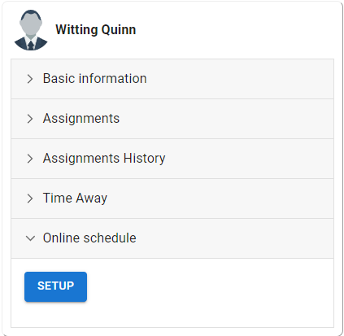
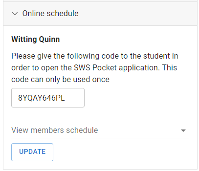

# Create a pocket user

With the latest alpha release of LMM-OA, you can now give the permission to a student to view the midweek meeting schedule. Once the permission is given, the student will now have access to the **SWS Pocket** app. **(not released yet)**

1. To create the pocket user, you must first be connected to your online account.
2. Open the **Students** page, and search for the student that you want to give access to.
3. Click the edit icon to open the Student Details page.
4. Expand the **Online schedule** section, and click **SETUP**.

   

5. Give the code that was generated to the student in order to open the SWS Pocket app. Please note that this code can only be used once.

   

6. Additionally, if needed, assign additional permissions to the student to view another members schedule and click **UPDATE**.
