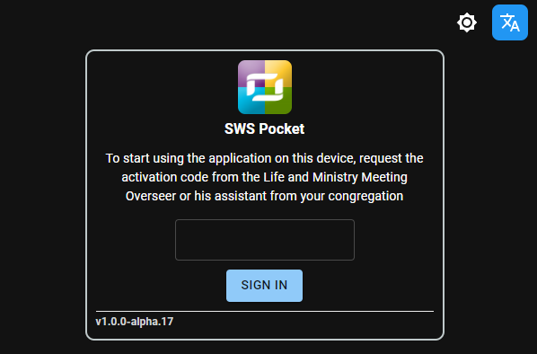
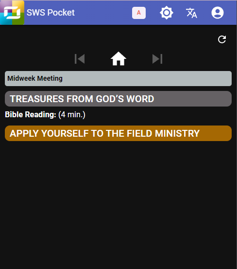
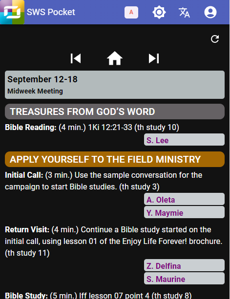
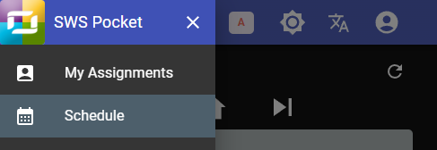
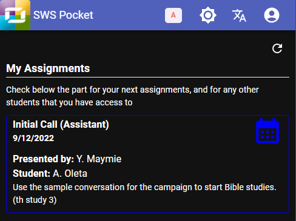
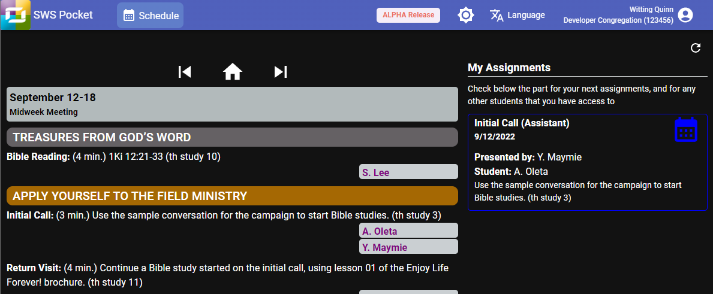

# Signup to SWS Pocket

SWS Pocket, is an application designed for use by the students for midweek meeting. We will guide you in the following steps on how to open the application:

1. Visit [https://alpha-sws-pocket.web.app](https://alpha-sws-pocket.web.app).
2. Enter the activation code that the elder gave you.

   

3. If the code you entered is valid, SWS Pocket will open:

   

4. Then, click the refresh icon  to get the midweek meeting schedule.

   

5. On smaller devices, click the image logo on the top left to open the SWS Pocket menu:

   

6. Click **My Assignments** to view your assignments in the meeting schedule. Assignments for other students will appear here as well if you have been given access to view their parts:

   

7. On larger devices, the **Schedule** and **My Assignments** are combined together:

   
