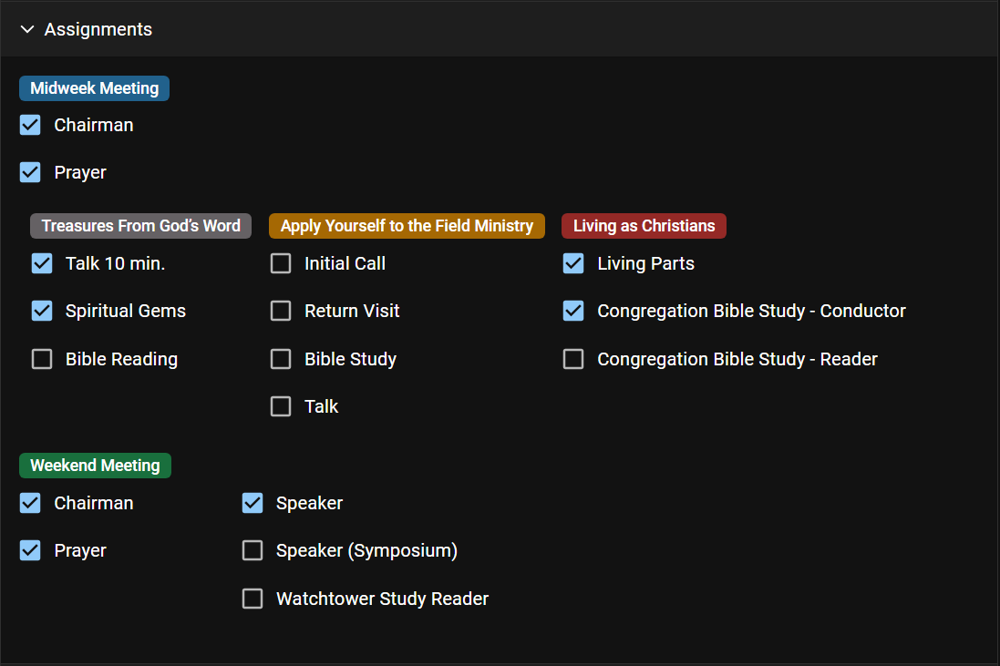

# Create and Edit a Person

## Create a new person

To create a new person to CPE:

- Use the **Add Person** from the Dashboard page.
- Open the **Persons** page first. On larger device, click the _Plus_ icon on the right. On smaller device, click the three dots menu on the right, and choose **Add new person**.

## Edit a person

From the Persons page, click the _Pencil_ icon to view the details of a person. These details are divided into five sections:

### Basic Information

- **Name:** name of the person
- **Display name:** display name of the person. It is auto populated but it can be overwritten. Depending on your congregation settings, this is the name that is displayed on the meeting schedule.
- **Gender:** gender of the person
- **Date of birth:** date when the person was born
- **Age:** current age of the person. It is auto calculated and could not be edited
- **Email address**: email address(es) of the person
- **Address:**: address of the person
- **Phone number:** phone number(s) of the person

:::caution

Some of these informations can only be edit by the Congregation Secretary.

:::

### Spiritual Status

- Choose if the person is an **anointed** one or **other sheep**.
- Choose whether the person is **baptized** or not. If yes, enter the **Date immersed**. The **Years** since the person was baptized will be auto calculated.
- **First report:** This is the month where field service report is first collected for this person.

:::danger

Make sure that this date is correct, especially the first time you use CPE, or when person move to your congregation. Otherwise, you will have falsy report where the person will be counted as an inactive publisher.

:::

- **Spiritual Status:** person’s spiritual status history. This includes when the person is a **Publisher, Ministerial Servant** and **Elder**.

  

:::caution

When a person’s status is changed, add an end date to the previous active status, and add the new status with the correct start date.

:::

- **Other form of services:** person’s other form of service history. This includes when the person is an **Auxiliary Pioneer, Regular Pioneer** and **Special Pioneer**.

:::caution

All these informations can only be edit by the Congregation Secretary.

:::

### Assignments

This section is for all meeting assignments for the person. Currently, it only contains midweek meeting assignments.

:::caution

Currently, these informations can only be edit by the Life and Ministry Meeting Overseer or his assistant.

:::

### Assignments History

This section contains all the meeting assignments this person had. It is a _read only_ information.

### Time Away

This section contains all the dates when the person will not be available for any meeting assignments.

## Save your changes

To save the changes you made for the person, click the **Save** button on the top of the page.

## Mark person as moved

If a person is moved to another congregation, , click the **Mark Move** button on the top of the person details page. This will remove the person from the Congregation Persons list.

## Mark person as disqualified

If a person is disqualified, click the **Mark Disqualified** button on the top of the person details page. The person will no longer be able to receive any meeting assignments.

## Mark person as enabled

If a person is qualified again for meeting assignments, click the **Mark Enabled** button on the top of the person details page.
