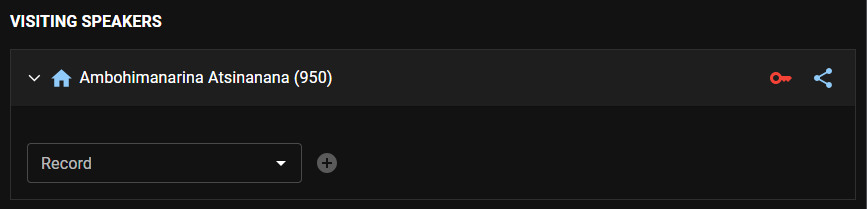
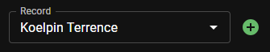
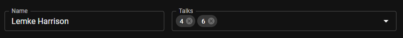
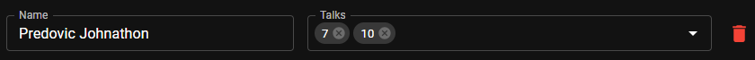
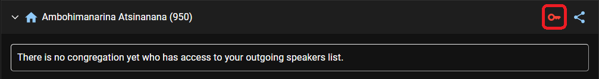
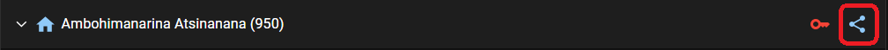

# Visiting Speakers

Open the Visiting Speakers from the Dashboard page. This is where you manage your congregation visiting speakers and the incoming speakers from other congregations.

## Manage congregation visiting speakers list

### Appoint new speaker

- Find the speaker record from the dropdown list and click the _Plus_ icon.

  

### Edit speaker talks

- Find the speaker from the list, and add or remove talks he has prepared to be delivered in another congregations.

  

### Remove speaker

- Find the speaker from the list, and click the _Delete_ icon.

  

### View and edit congregations having access to speakers list

- Click the _Key_ icon next to your congregation name to open the access editor.

  

- To remove a congregation from the list, click the **x** icon next to its name.
- Click the _Key_ icon again to close the access editor.

### Share the speakers list

- Click the _Share_ icon next to your congregation name to share the speakers list. The list will be encrypted and saved on the cloud to be fetched by other congregations using CPE.

  

## Manage visiting speakers from other congregations
