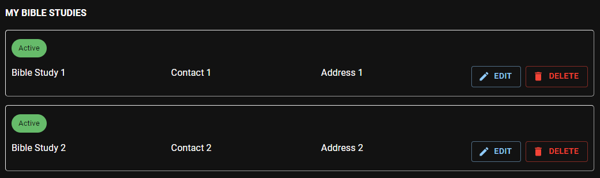

# My Bible Studies

In this section, you can view, edit and delete your Bible studies.

:::info

These Bible study records are needed when entering the [daily field service records](./my_reports#bible-studies).

:::

## Add new Bible study record

- Click the **_Plus_** icon on the bottom left of the screen to add a new Bible study record.
- Enter the **name, ** and if needed, the **contact** and **address.**
- Click **Save** to complete.

## Edit Bible study record

- Find the record you want to edit from the list, and click the **Edit** button.
- Make the necessary changes, and click **Save**.

## Delete Bible study record

- Find the record you want to delete from the list, and click the **Delete** button.
- If the person is no longer used in any of your field service reports, it will be deleted and removed from the list.
- If the person is still in use, the record will be marked as **_inactive_**. You can try deleting it later.
