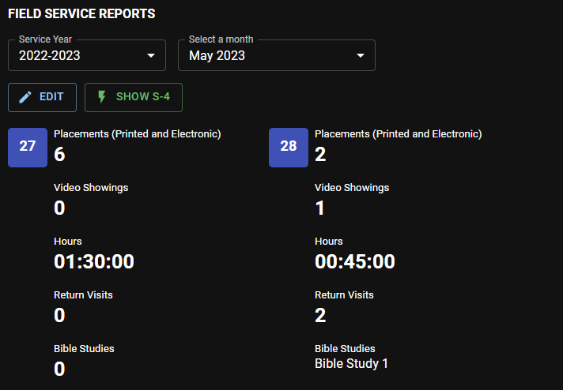

# My Reports

In this section, you can view, edit and submit your monthly field service reports.

## Edit daily field service records

To record your daily field service records, first, select the Service Year and the month you want to edit.

- Click the **Edit** button.

- Select the **Date**.

- Enter each item accordingly. All the changes you made are automatically saved.

  

- Click the **Collapse** button to hide the daily field service record editor.

### CPE Stopwatch

CPE can be used as a stopwatch to record the time you spent in the field ministry. To start the timer, click the ***Start*** icon. To pause, click the ***Pause*** icon. You can resume it later if needed. And to stop the timer, click the ***Stop*** icon.

### Bible Studies

This entry will use your [Bible Study records](./my_bible_studies). If no record appears, please make sure you have active Bible Studies records.

## S-4 Field Service Report

- Click the **Show S-4** button to generate and display the monthly field service report.

  

- Click the **Collapse S-4** button to hide the S-4 report.

### Submit report

- If necessary, add comments to your S-4 report.
- Click the **Submit S-4** button to send your report to the Secretary.

:::info

It will no longer be possible to edit the daily record when the S-4 report is submitted. If changes are necessary, undo the submission.

:::

### Undo submission

- If changes are necessary after your report has been submitted, click the **Undo Submission** button, and make the necessary changes.

  

- Click the **Submit S-4** button again to send your report to the Secretary.

:::caution

Please note that it is no longer possible to undo the submission when the report was already reviewed and accepted by the Secretary.

:::