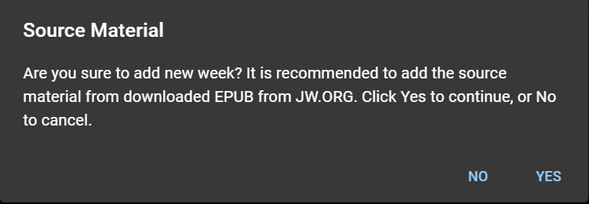

# Add New Week

:::tip

We do not recommend using this feature. The reason: it will take too much time for you to enter all the meeting data from the Meeting Workbook and Watchtower Study for each week.

:::

If you want to add week to the source material, and you cannot connect to the internet or import an EPUB file, do the following:

- Click **Add New Week** under the Source Material card.

  

- Click YES.
