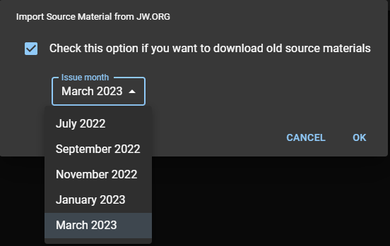

# Import from JW.ORG

This is the recommended method to add source materials, when you are using CPE in a device with an internet connection. Open CPE, and click **Import from JW.ORG** under the Source Material card.

## Import current source materials

If you want to import the current source materials, which is the current and future Meeting Workbook issues, simply click OK.

:::caution

Make sure that the option **Check this option if you want to download old source materials** is always unchecked.

:::

## Import oldest source materials

If you want to import an oldest Meeting Workbook issue, check the option **Check this option if you want to download old source materials**. Then, choose which issue you would like to import, and click OK.

CPE will download and import the source materials from jw.org. A confirmation message will appear when the import is completed. Click OK to complete.

