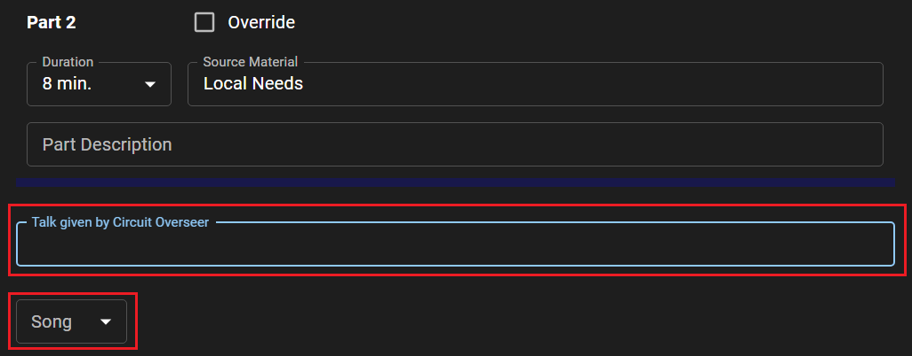
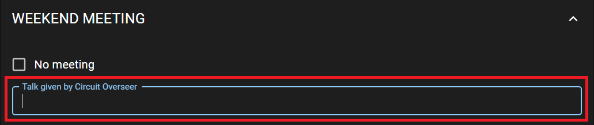

# View Source Material

## Edit week

- Click the _Pencil_ icon next to week date you want to edit. The following page will open:

  

- Make any necessary adjustments to each field, and click the _Save_ icon to save your changes.

### Override parts in Living As Christians

When it is necessary to replace parts in Living As Christians, do the following:

- Expand the MIDWEEK MEETING section.

- Under Living As Christians, locate which parts you want to replace and check **Override**.

  

  In the example above, it was necesarry to check **Override** for the second part to cancel it.

- Adjust the timing of others parts. The total timings should be 45 min.

  

### Adding additional text to weekend meeting schedule when there is no meeting

- Expand the WEEKEND MEETING section.

- Enter the text you want in the **Add text to schedule** field.

  

  This text will be added to the schedule:

  

### Circuit Overseers Talks

- Make sure that the week **Type** is **Visit of Circuit Overseer.**

- Expand the MIDWEEK MEETING section.

- Under Living As Christians, enter the title of the circuit overseer service talk for the midweek meeting. Enter the concluding song also if it is provided.

  

- Expand the WEEKEND MEETING section.

- Enter the title of the circuit overseer public talk for the weekend meeting.

  

- Don’t forget to click the _Save_ icon to save your changes.

## Delete a week

- Click the _Delete_ icon next to the week date to delete it from the source material.
