# Midweek Meeting

Here is the section where you will manage the meeting parts for the midweek meeting.

## Assign person

Locate from the list which schedule you want edit. Then, you have two options to assign the meeting parts:

### Use autofill

- Click the **Autofill** button.

  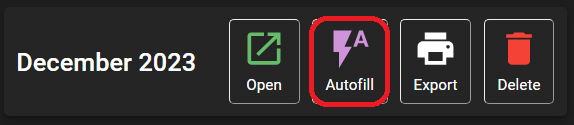

- A confirmation message will appear and click **AUTOFILL** to confirm.

  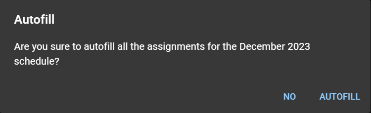

:::info

If some parts were already assigned, the autofill action **will not** override them.

While autofill also will greatly simplify much of your works, we trust that you will use good judgment and balance when doing the assignments. 😉

:::

### Manual assignment

- Click the **Open** button.

  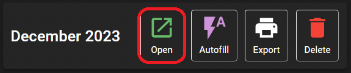

- A summary page will open:

  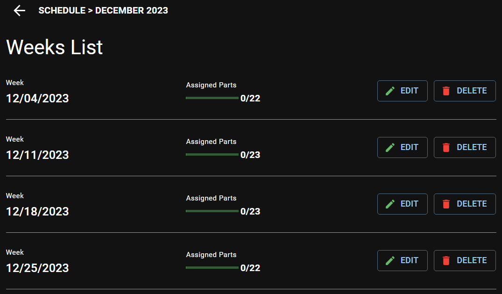

  Click the **EDIT** button next to the week date you want to make assignments.

- Finally, choose a person to assign for each meeting part. Please note the following when doing manual assignment:

  - The **last assignment** column when choosing a person to handle a non-student part is the last time this person delivered the same part.

    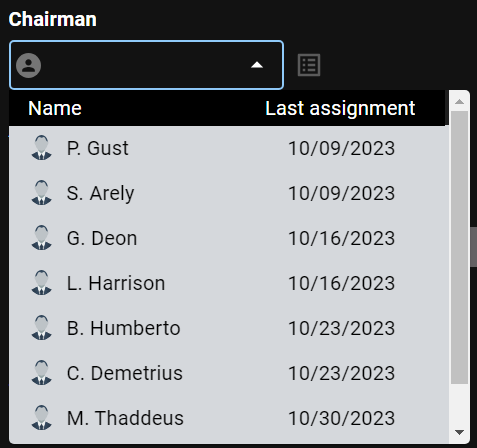

    In the example above, these dates indicate the last time these brothers were used as Chairman.

  - For the students parts, choose whether to assign **Male** or **Female**. The **last assignment** column when choosing a person to handle the student part is the last time this person was used as a student, regardless of the assignment type. The **assistant** column is the last time this person was used as an assistant.

    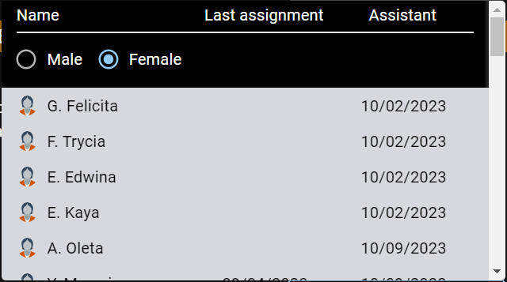

  - For the students parts, you will not be able to assign an assistant until the student is assigned.

  - Click the _Details_ icon to view all assignments of a person.

    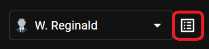

    The following list will appear:

    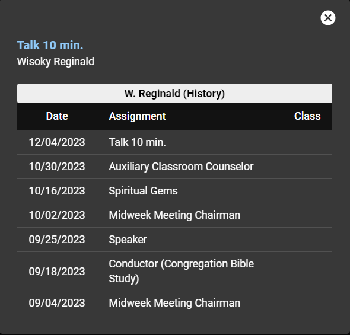

    When viewing the assignments history of an assistant, all the assistants who were already with the student will also be displayed:

    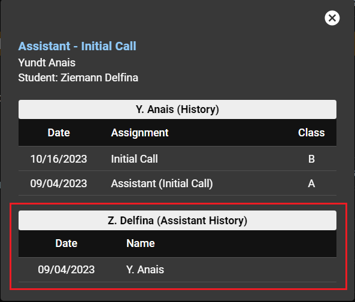

  - To delete an assignment, click the **x** icon next to the person name.

    

  - It will not be possible to select a person for some meetings parts that do not need assignment. (organizational accomplishments, etc...)

  - For meeting part that should be handled by an elder, the list will only show all the elders. (local needs, etc...)

  - Use the _Forward_ and _Backward_ buttons in the top of the page to navigate between weeks.

    

## Delete assignments

- If you want to delete all assignments for the month:

  - Click the **Delete** button.

    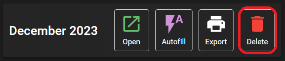

  - A confirmation message will appear and click **DELETE** to confirm.

    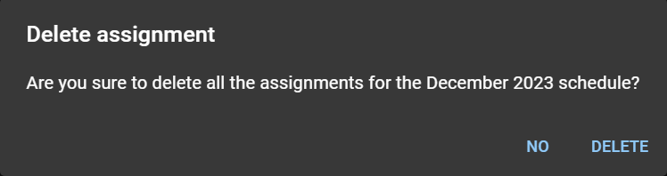

- If you want to delete all assignments for a week only:

  - Click the **Open** button.

    

  - In the summary page, click the **DELETE** button next to the week containing the assignments you want to delete.

    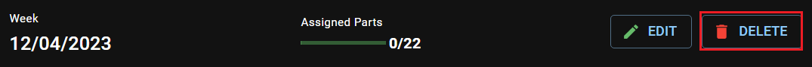

  - A confirmation message will appear and click **DELETE** to confirm.

    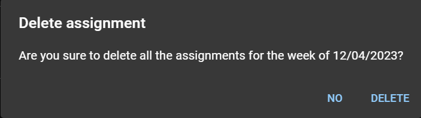

## Export schedule

### S-89 Assignment Form

- Click the **Export** button and choose **S-89 Assignment Form.**

  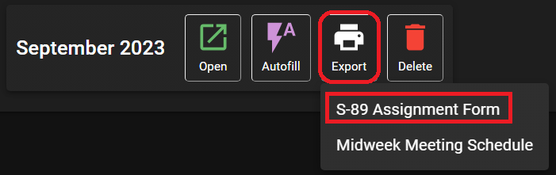

- Select which week and assignment you want to print, and click **PREVIEW.**

  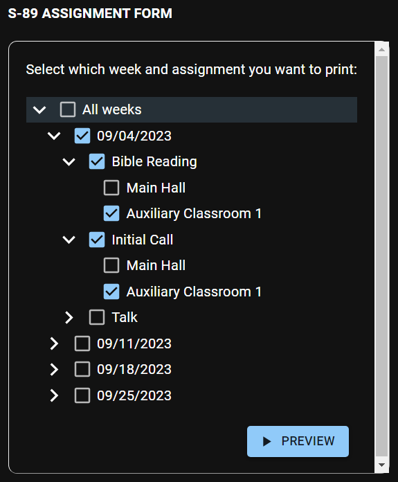

- After the preview is generated, click the **PDF** button to export the S-89 Assignment Form.

  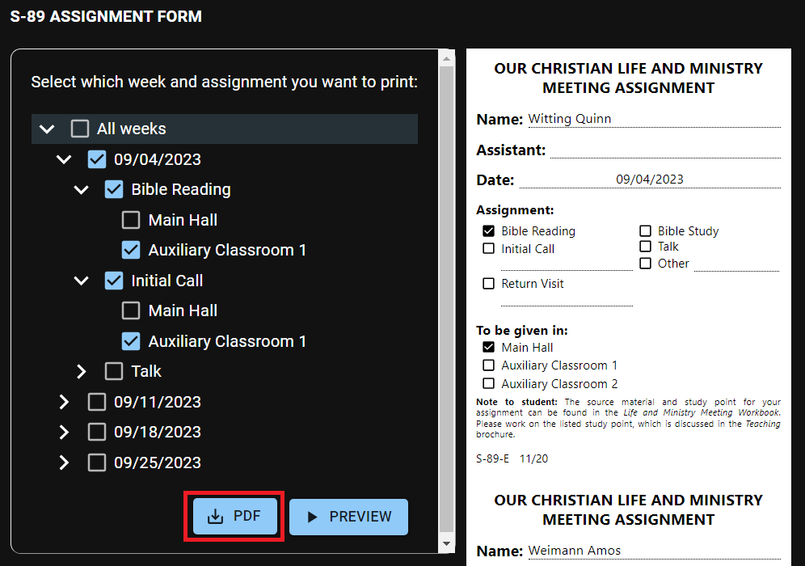

### Midweek Meeting Schedule (S-140)

- Click the **Export** button and choose **Midweek Meeting Schedule.**

  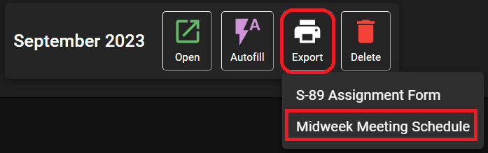

- Depending on your device settings, the PDF file will be downloaded directly or you will be asked where to save it.
