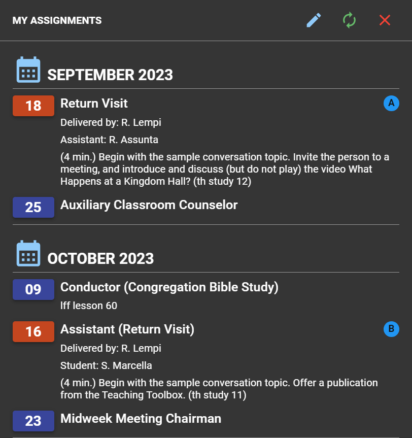
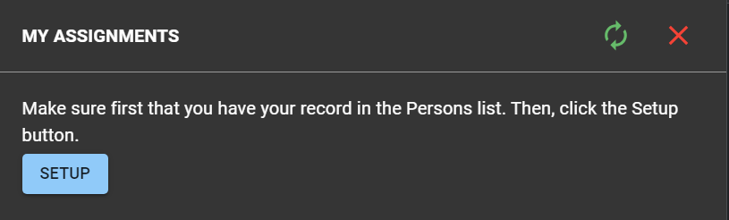
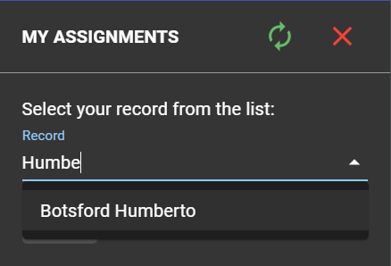

# My Assignments

This section will display all your assignments for midweek and weekend meetings. If you delegate other persons, their assignments will be displayed here too.

In most of cases, no setup is needed to have your meeting parts to be displayed here. However, if CPE prompts you to setup, do the following:

## Initial setup

- Click the **SETUP** button.

  

- Select your name from the list.

  

- Click **SAVE.**

## Edit your local record

- Click the _Pencil_ icon if you want to change your local record.

  

## Refresh assignments

- Click the _Refresh_ icon to refresh the assignments.

  
