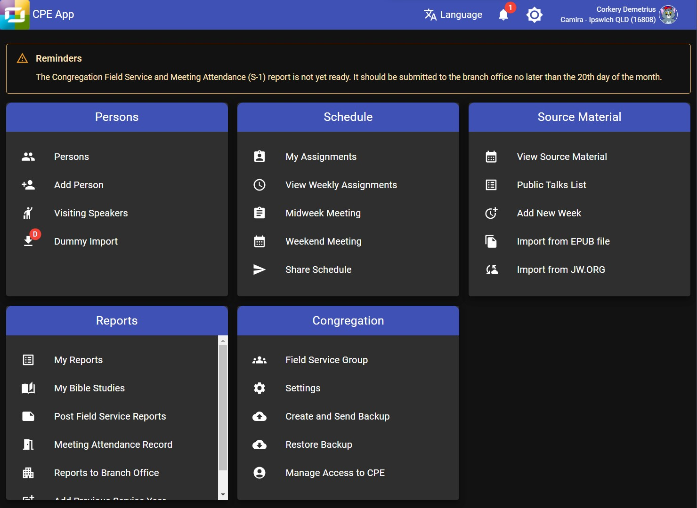

# About Organized app

Organized is a free progressive web application crafted specifically for Jehovah's Witnesses congregations. Developed by our team at Scheduling Workbox System, it's designed for ease of use by every member of the congregation.

## Is Organized an official application from the organization?

No, it is not an official app from the organization of Jehovah’s Witnesses. Organized offers beneficial features for congregations, but its use is your choice. We recommend talking with your congregation elders before starting to use the app for the whole congregation. Also, we know that there are other similar apps, each with its own way of helping, but all aim to support congregations. We're not trying to judge which app is the best. Simply try Organized to see if it's a good fit for you.

## Why Organized is a web application? Is it safe?

We believe that transitioning from desktop applications to web applications offers more advantages and flexibility. Web applications are not dependent on system or hardware specifications; you can launch them from any platform or device with a browser, whether you work with Windows, Mac, Linux, ChromeOS or mobile Android, iPasOS, or iOS devices. We are well aware of the security challenges of web applications. Be confident that we have built the app using the most advanced and secure approach and we are actively enhancing the security of Organized, consistently keeping up with the latest advancements and changes in web technologies. We've implemented multiple special security measures (for example, local storage, end-to-end encryption, two-factor authentication, app lock feature, and more) to ensure that only members of your congregation can access the information, keeping it strongly confidential.

# What are the main benefits of using the app?

When it comes to tangible benefits in real-life situations, consider the following: Reduced stress for every congregation member, hundreds of hours saved for appointed brothers, streamlined digital processes with way less waste, improved speed of collaboration, and enhanced convenience for all. To explore Organized in a more visual format, feel free to visit our [YouTube channel](https://www.youtube.com/@organized-app) or the [About Organized](https://about.organized-app.com) webpage — an ideal resource to introduce Organized to others.
