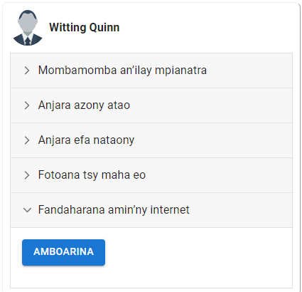

# Hamorona kaonty Pocket

Efa azonao atao izao ny manome alalana mpianatra mba hijery ny fandaharana amin’ny fivoriana andavanandro, amin’ny version farany amin’ny LMM-OA. Afaka hampiasa ilay programa hoe **SWS Pocket** ilay mpianatra aorian’izay.

1. Mila miditra amin’ny kaontinao ao amin’ny internet aloha ianao, izay vao afaka manamboatra kaonty Pocket.
2. Midira ao amin’ny **Mpianatra**, dia karohy ilay mpianatra tianao omena alalana.
3. Tsindrio ilay sary kely fanokafana ny fanazavana momba an’ilay mpianatra.
4. Tsindrio eo amin’ilay fizarana hoe **Fandaharana amin’ny internet**, ary tsindrio ilay hoe **AMBOARINA**.

   

5. Omeo an’ilay mpianatra avy eo ilay kaody miseho eo mba hahafahany manokatra ny programa SWS Pocket. Indray mandeha ihany no azo ampiasaina io kaody io.

   

6. Fanampin’izay, ampidiro koa ny fandaharan’ny mpianatra hafa azon’ilay mpianatra jerena, raha ilaina izay, dia tsindrio ilay hoe **HANOVA**.
