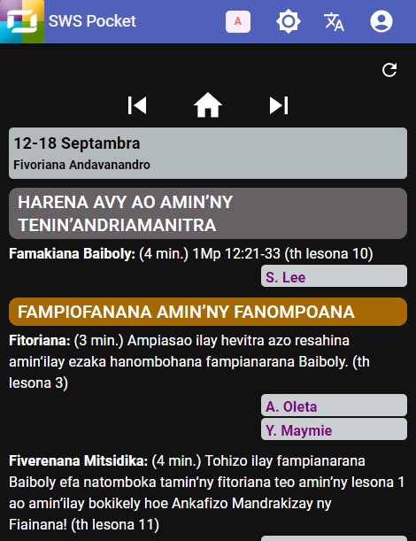

# Hiditra amin’ny SWS Pocket

Programa natao ho ampiasain’ny mpianatra amin’ny fivoriana andavanandro ny SWS Pocket. Atoronay anao eto ambany ny zavatra mila atao raha vao hanokatra ilay programa voalohany ianao:

1. Tsidiho ny [https://sws-pocket.web.app](https://sws-pocket.web.app).
2. Ampidiro ny kaody fanamarinana nomen’ny anti-panahy anao.

   

3. Hisokatra ny SWS Pocket raha marina ny kaody nampidirinao:

   

4. Tsindrio avy eo ilay sary kely  ery ambony mba ahazoanao ny fandaharam-pivoriana andavanandro.

   

5. Amin’ny fitaovana kelikely kokoa, tsindrio ilay sary famantarana ery ambony ankavia mba hanokafana ny menu amin’ny SWS Pocket:

   

6. Tsindrio ilay hoe **Anjarako** mba hahitanao ny anjaranao amin’ny fivoriana andavanandro. Hiseho eo koa ny anjaran’ny mpianatra hafa raha nomena alalana hijery ny anjaran’izy ireo ianao:

   

7. Amin’ny fitaovana lehibe kokoa, dia mikambana toerana iray ilay hoe **Fandaharana** sy **Anjarako**:

   
