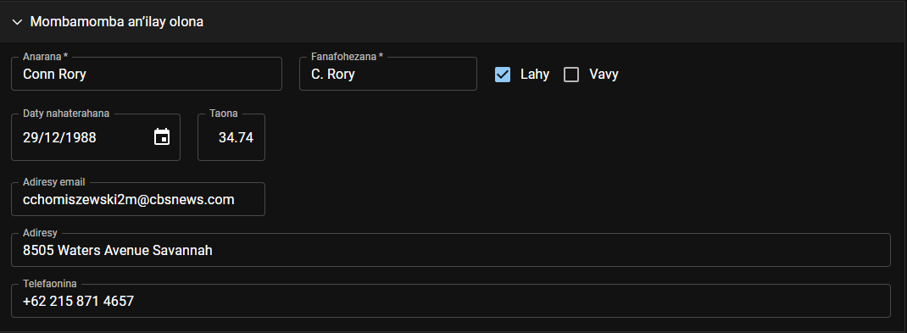
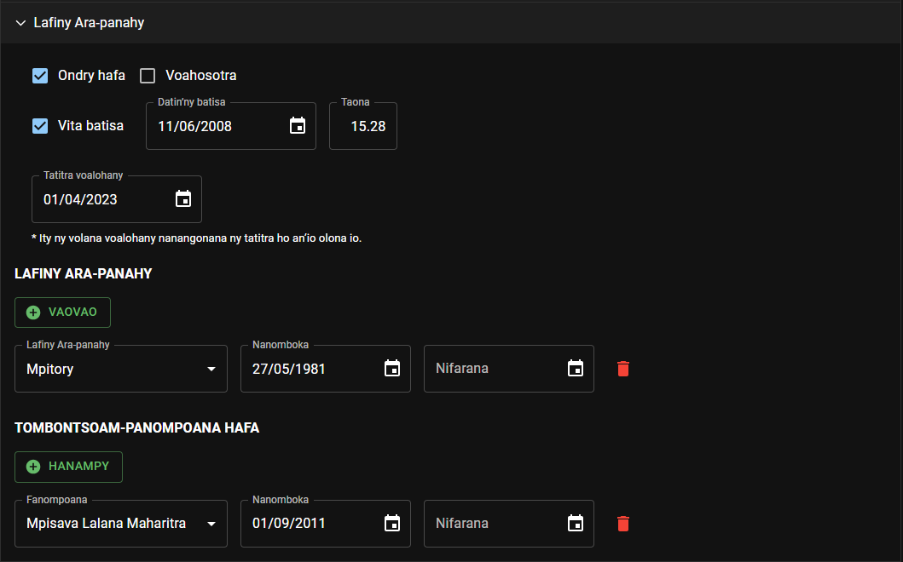
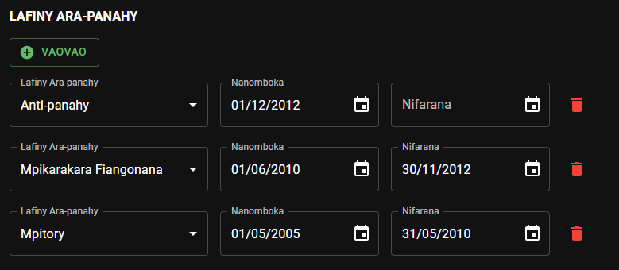
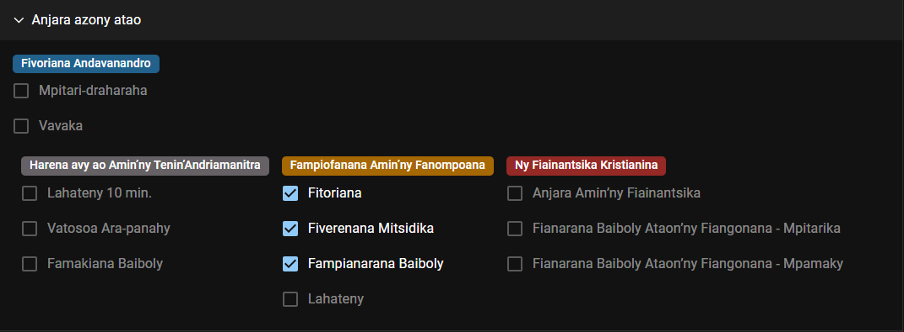
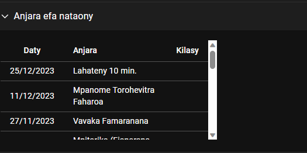
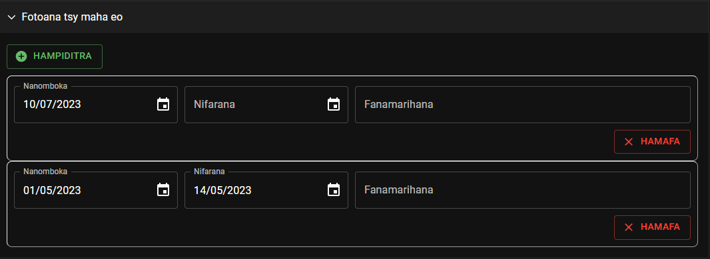

# Hampiditra sy Hanova Olona Ao Amin’ny Fiangonana

## Hampiditra olona vaovao

Izao atao raha hampiditra olona vaovao ao amin’ny CPE:

- Ampiasao ilay hoe **Hanampy Olona Vaovao** eo amin’ny pejy fandraisana.
- Sokafy aloha ilay pejy hoe **Olona ao Amin’ny Fiangonana**. Raha somary lehibe ny fitaovana ampiasainao, dia tsindrio ilay sary _Plus_ eo amin’ny sisiny ankavanana. Raha fitaovana kely kosa, dia tsindrio ilay teboka telo eo amin’ny sisiny ankavanana, dia safidio ilay hoe **Hanampy olona vaovao.**

## Hanova ny mombamomba ny olona iray

Sokafy ilay pejy hoe Olona ao Amin’ny Fiangonana, dia tsindrio ilay sary _Pensilihazo_ eo amin’ilay olona mba hijerena ny mombamomba azy. Misy fizarana maromaro ireo fanazavana ireo:

### Mombamomba an’ilay olona

- **Anarana:** anaran’ilay olona
- **Fanafohezana:** fanafohezana ny anaran’ilay olona. Feno ho azy izy io, nefa azonao soloana izay misoratra eo. Hiseho any amin’ny fandaharam-pivoriana ho atao printy ity fanafohezana anarana ity, arakaraka ny fanamboarana nosafidiana ho an’ny fiangonanareo.
- Safidio hoe **Lahy** sa **Vavy** ilay olona
- **Daty nahaterahana:** daty nahaterahan’ilay olona
- **Taona:** taonan’ilay olona amin’izao. Feno ho azy izy io, ary tsy azo ovaina.
- **Adiresy email:** adiresy emai ampiasain’ilay olona
- **Adiresy:** adiresin’ilay olona
- **Telefaonina:** nomerao telefaonin’ilay olona

:::info

Ny Mpitan-tsoratra ihany no afaka manova an’ireo fanazavana sasantsasany ireo.

:::

### Lafiny Ara-panahy

- Safidio hoe **voahosotra** ve ilay olona sa **ondry hafa.**
- Safidio hoe **vita batisa** ve ilay olona sa tsia. Raha eny, dia ampidiro ny **Datin’ny batisa.** Ho feno ho azy avy eo ny **Taona** efa nahavita batisa an’ilay olona.
- **Tatitra voalohany:** Ity ny volana voalohany nanangonana ny tatitra ho an’io olona io.

:::caution

Ataovy azo antoka hoe marina tsara io daty io, indrindra raha vao voalohany ianao no mampiasa CPE, na hoe nifindra fiangonana ao aminareo ilay olona. Raha tsy izany mantsy dia mety ho voasokajy ho anisan’ny mpitory tapatapaka ilay olona.

:::

- **Lafiny Ara-panahy:** lafiny ara-panahin’ilay olona. Tafiditra amin’izany ny hoe **Mpitory, Mpikarakara Fiangonana** ary **Anti-panahy** ve izy.

  

:::caution

Raha miova ny lafiny ara-panahin’ilay olona, dia asio daty nifaranana ny nisy azy teo aloha, ary ampidiro ny lafiny ara-panahy vaovao ka ataovy marina tsara ny daty nanombohany.

:::

- **Tombontsoam-panompoana hafa:** tombontsoam-panompoana hafa ananan’ilay olona. Tafiditra amin’izany ny hoe **Mpisava Lalana Mpanampy, Mpisava Lalana Maharitra** ary **Mpisava Lalana Manokana** ve izy.

:::info

Ny Mpitan-tsoratra ihany no afaka manova an’ireo fanazavana sasantsasany ireo.

:::

### Anjara azony atao

Eto amin’ity fizarana ity no ahitana ny anjara rehetra azon’ilay olona atao rehefa fivoriana.

:::info

Ny Mpiandraikitra ny Fivoriana Momba ny Fiainantsika sy ny Fanompoana na ny mpanampy azy, ny Mpandrindra Lahateny ho An’ny Besinimaro ary Anti-panahy Mpandrindra ihany no afaka manova an’ireo fanazavana ireo.

:::

### Anjara efa nataony

Hita eto amin’ity fizarana ity ny anjara rehetra efa nataon’ilay olona. Natao _hojerena fotsiny_ ny fanazavana miseho eto.

### Fotoana tsy maha eo

Hita eto amin’ity fizarana ity ny fotoana rehetra tsy maha eo an’ilay olona ka tsy ho afaka omena anjara amin’ny fivoriana izy.

## Hitahiry ny fanovana ataonao

Tsindrio ilay hoe **Hitahiry** eo ambony indrindra amin’ilay pejy, raha hitahiry ny fanovana nataonao tamin’ny olona anankiray.

## Marihina hoe nifindra fiangonana

If a person is moved to another congregation, click the **Mark Move** button on the top of the person details page. This will remove the person from the Congregation Persons list.

## Marihina hoe tsy mahafeno fepetra

Raha tsy mahafeno fepetra intsony ny olona iray, dia tsindrio ilay hoe **Tsy Mahafeno Fepetra** eo ambony indrindra amin’ilay pejy. Tsy hahazo anjara amin’ny fivoriana intsony ilay olona aorian’izay.

## Marihina hoe omena anjara

Raha mahafeno fepetra handray anjara amin’ny fivoriana indray ny olona iray, dia tsindrio ilay hoe **Omena Anjara** eo ambony indrindra amin’ilay pejy.
