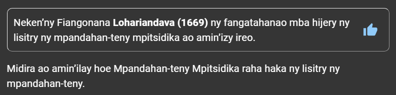
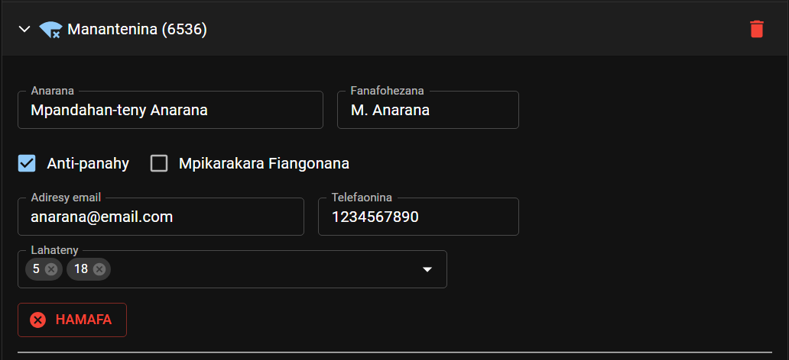

# Mpandahan-teny Mpitsidika

Sokafy ilay pejy hoe Mpandahan-teny Mpitsidika. Ao no handrindrana an’ireo mpandahan-teny mpitsidika avy ao amin’ny fiangonana misy anareo, sy ireo mpandahan-teny avy any amin’ny fiangonana hafa.

## Handrindra ny mpandahan-teny mpitsidika ao amin’ny fiangonana

### Hanendry mpandahan-teny

- Karohy eo amin’ilay lisitra ny anaran’ilay mpandahan-teny, dia tsindrio avy eo ilay sary _Plus._

  

### Hanamboatra ny lahateny ataon’ny mpandahan-teny

- Jereo eo amin’ilay lisitra ny anaran’ilay mpandahan-teny, dia ampidiro na anesory ny lahateny efa nomaniny ka afaka ataony amin’ny fiangonana hafa.

  

### Hanala mpandahan-teny

- Jereo eo amin’ilay lisitra ny anaran’ilay mpandahan-teny, dia tsindrio avy eo ilay sary _Hamafa._

  

### Handrindra an’ireo fiangonana afaka mijery ny lisitry ny mpandahan-teny mpitsidika

- Tsindrio ilay sary _lakile_ eo akaikin’ny anaran’ny fiangonana misy anareo raha hanokatra ny fandrindrana ny alalana hijery mpandahan-teny mpitsidika.

  

- Tsindrio ilay **x** eo akaikin’ny anaran’ilay fiangonana raha tsy omena alalana hahita ny lisitry ny mpandahan-teny intsony ilay fiangonana.

  

- Tsindrio indray ilay sary _lakile_ raha hanakatona ny fandrindrana ny alalana hijery mpandahan-teny mpitsidika.

### Hizara ny lisitry ny mpandahan-teny mpitsidika

- Tsindrio ilay _Hizara_ eo akaikin’ny anaran’ny fiangonana misy anareo raha hizara ny lisitry ny mpandahan-teny mpitsidika. Ho voaro sy voatahiry amin’ny toerana azo antoka any amin’ny internet avy eo ilay lisitra mba ho azon’ireo fiangonana mampiasa CPE alaina.

  

### Fikarakarana ny fangatahana hijery ny lisitry ny mpandahan-teny mpitsidika

- Hisy hafatra toy izao hipoitra rehefa misy fiangonana hafa mangataka ny hijery ny lisitry ny mpandahan-teny mpitsidika ao aminareo:

  

- Afaka manaiky na mandà an’ilay fangatahana ianao.

## Handrindra ny mpandahan-teny mpitsidika avy any amin’ny fiangonana hafa

### Fiangonana mampiasa CPE

#### Hanampy fiangonana

- Tsindrio ilay hoe **HANAMPY FIANGONANA.**

- Karohy sy safidio avy eo ilay fiangonana tianao ampidirina.

  

- Tsindrio ny **HITAHIRY.**

- The newly added congregation will be added to the list with an _orange_ icon. This means that it is waiting for an approval from the requested congregation. You will not be able to download and see the speakers list until the request is approved.

  

- When your request is approved, the following notification will appear:

  

  And the _orange_ icon will turn _green._

  

#### Get Speakers List

- To get the speakers list from congregations using CPE, you have two options:

  - Use the **GET ALL SPEAKERS** to download speakers from all approved congregations in the list.

    

  - Use the _Download_ icon next to each congregation to download only its speakers list.

    

- The speakers information will be downloaded and added to your record. Please note that you cannot edit any of these informations. If changes are needed, contact the congregation directly.

  

### Adding congregation manually

#### Hanampy fiangonana

- Tsindrio ilay hoe **HANAMPY FIANGONANA.**

- Enter the congregation name and number.

  

- Tsindrio ny **HITAHIRY.**

- The newly added congregation will be added to the list with a _blue_ icon.

  

#### Manage speakers list

- To add new speaker, fill all the required information and click **ADD**.

  

- Then add or remove the talks this person can deliver.

  

- Click the **DELETE** button to delete a speaker from the visiting speakers list.

### Delete congregation

- Click the _Delete_ icon next to the congregation name to delete it from your record.

  
