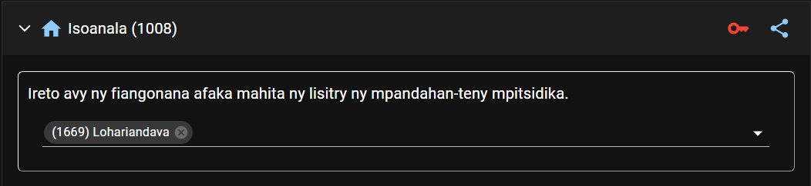

# Mpandahan-teny Mpitsidika

Open the Visiting Speakers from the Dashboard page. This is where you manage your congregation visiting speakers and the incoming speakers from other congregations.

## Handrindra ny mpandahan-teny mpitsidika ao amin’ny fiangonana

### Hanendry mpandahan-teny

- Karohy eo amin’ilay lisitra ny anaran’ilay mpandahan-teny, dia tsindrio avy eo ilay sary _Plus._

  

### Hanamboatra ny lahateny ataon’ny mpandahan-teny

- Jereo eo amin’ilay lisitra ny anaran’ilay mpandahan-teny, dia ampidiro na anesory ny lahateny efa nomaniny ka afaka ataony amin’ny fiangonana hafa.

  

### Hanala mpandahan-teny

- Jereo eo amin’ilay lisitra ny anaran’ilay mpandahan-teny, dia tsindrio avy eo ilay sary _Hamafa._

  

### Handrindra an’ireo fiangonana afaka mijery ny lisitry ny mpandahan-teny mpitsidika

- Tsindrio ilay sary _lakile_ eo akaikin’ny anaran’ny fiangonana misy anareo raha hanokatra ny fandrindrana ny alalana hijery mpandahan-teny mpitsidika.

  

- Tsindrio ilay **x** eo akaikin’ny anaran’ilay fiangonana raha tsy omena alalana hahita ny lisitry ny mpandahan-teny intsony ilay fiangonana.

  

- Tsindrio indray ilay sary _lakile_ raha hanakatona ny fandrindrana ny alalana hijery mpandahan-teny mpitsidika.

### Hizara ny lisitry ny mpandahan-teny mpitsidika

- Click the _Share_ icon next to your congregation name to share the speakers list. The list will be encrypted and saved on the cloud to be fetched by other congregations using CPE.

  

### Fikarakarana ny fangatahana hijery ny lisitry ny mpandahan-teny mpitsidika

- Hisy hafatra toy izao hipoitra rehefa misy fiangonana hafa mangataka ny hijery ny lisitry ny mpandahan-teny mpitsidika ao aminareo:

  

- Afaka manaiky na mandà an’ilay fangatahana ianao.

## Handrindra ny mpandahan-teny mpitsidika avy any amin’ny fiangonana hafa

### Fiangonana mampiasa CPE

#### Hanampy fiangonana

- Tsindrio ilay hoe **HANAMPY FIANGONANA.**

- Karohy sy safidio avy eo ilay fiangonana tianao ampidirina.

  

- Tsindrio ny **HITAHIRY.**

- The newly added congregation will be added to the list with an _orange_ icon. This means that it is waiting for an approval from the requested congregation. You will not be able to download and see the speakers list until the request is approved.

  

- Hisy hafatra toy izao hipoitra rehefa nanaiky ny fangatahanao ilay fiangonana:

  

  Hiova ho loko _maintso_ ilay loko _volondaoranjy_ amin’izay.

  

#### Haka ny lisitra ny mpandahan-teny

- Misy fomba roa azonao ampiasaina raha haka ny lisitry ny mpandahan-teny mpitsidika avy any amin’ny fiangonana mampiasa CPE ianao:

  - Ampiasao ilay hoe **HAKA NY MPANDAHAN-TENY REHETRA** raha haka ny lisitry ny mpandahan-teny rehetra avy amin’ireo fiangonana efa nanaiky ny hizara an’izany aminareo.

    

  - Ampiasao ilay sary _Haka_ eo akaikin’ny anaran’ilay fiangonana raha haka ny lisitry ny mpandahan-teny avy amin’io fiangonana io ihany.

    

- The speakers information will be downloaded and added to your record. Please note that you cannot edit any of these informations. If changes are needed, contact the congregation directly.

  

### Fiangonana tsy mampiasa CPE

#### Hanampy fiangonana

- Tsindrio ilay hoe **HANAMPY FIANGONANA.**

- Ampidiro ny anaran’ny fiangonana sy nomerao.

  

- Tsindrio ny **HITAHIRY.**

- Hipoitra eo amin’ilay lisitra avy eo ilay fiangonana vao avy nampidirina, ary misy loko _manga_ miaraka aminy.

  

#### Handrindra ny lisitry ny mpandahan-teny

- Raha hampiditra mpandahan-teny vaovao, dia fenoy tsara ny fanazavana rehetra ilaina. Tsindrio avy eo ilay hoe **HANAMPY.**

  

- Amboary avy eo ny lisitry ny lahateny azon’ilay rahalahy atao.

  

- Tsindrio ilay hoe **HAMAFA** raha ho esorina tsy ho amin’ilay lisitry ny mpandahan-teny ilay rahalahy.

### Hamafa fiangonana

- Tsindrio ilay sary _Hamafa_ eo akaikin’ny anaran’ilay fiangonana raha ho esorina tsy ho ao amin’ny firaketana ilay fiangonana.

  
