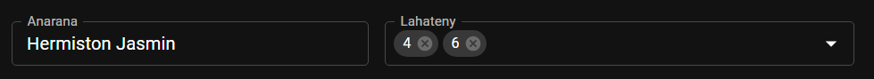
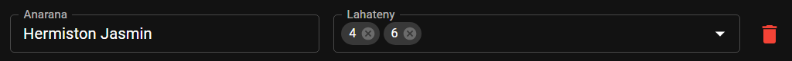
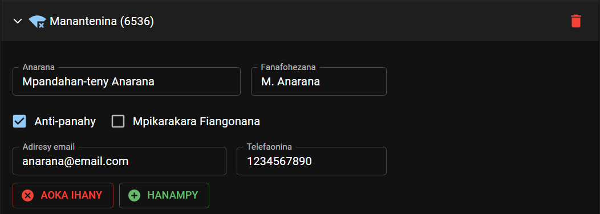
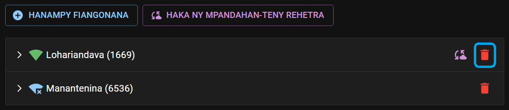

# Mpandahan-teny Mpitsidika

Open the Visiting Speakers from the Dashboard page. This is where you manage your congregation visiting speakers and the incoming speakers from other congregations.

## Manage congregation visiting speakers list

### Appoint new speaker

- Find the speaker record from the dropdown list and click the _Plus_ icon.

  

### Edit speaker talks

- Find the speaker from the list, and add or remove talks he has prepared to be delivered in another congregations.

  

### Remove speaker

- Find the speaker from the list, and click the _Delete_ icon.

  

### View and edit congregations having access to speakers list

- Click the _Key_ icon next to your congregation name to open the access editor.

  

- To remove a congregation from the list, click the **x** icon next to its name.

  

- Click the _Key_ icon again to close the access editor.

### Share the speakers list

- Click the _Share_ icon next to your congregation name to share the speakers list. The list will be encrypted and saved on the cloud to be fetched by other congregations using CPE.

  

### Handle incoming speakers access requests

- When another congregation requests access to view your visiting speakers list, the following notification will appear:

  

- Choose whether to accept or reject the request.

## Manage visiting speakers from other congregations

### Congregation using CPE

#### Add congregation

- Click the **ADD CONGREGATION** button.

- Search and choose the congregation you want to add.

  

- Click **SAVE** to complete.

- The newly added congregation will be added to the list with an _orange_ icon. This means that it is waiting for an approval from the requested congregation. You will not be able to download and see the speakers list until the request is approved.

  

- When your request is approved, the following notification will appear:

  

  And the _orange_ icon will turn _green._

  

#### Get Speakers List

- To get the speakers list from congregations using CPE, you have two options:

  - Use the **GET ALL SPEAKERS** to download speakers from all approved congregations in the list.

    

  - Use the _Download_ icon next to each congregation to download only its speakers list.

    

- The speakers information will be downloaded and added to your record. Please note that you cannot edit any of these informations. If changes are needed, contact the congregation directly.

  

### Adding congregation manually

#### Add congregation

- Click the **ADD CONGREGATION** button.

- Enter the congregation name and number.

  

- Click **SAVE** to complete.

- The newly added congregation will be added to the list with a _blue_ icon.

  

#### Manage speakers list

- To add new speaker, fill all the required information and click **ADD**.

  

- Then add or remove the talks this person can deliver.

  

- Click the **DELETE** button to delete a speaker from the visiting speakers list.

### Delete congregation

- Click the _Delete_ icon next to the congregation name to delete it from your record.

  
