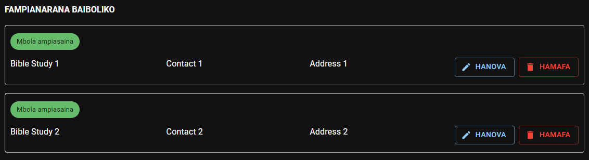

# Fampianarana Baiboliko

Afaka mijery, manova ary mamafa ny lisitry ny mpianatra Baibolinao ianao ato amin’ity fizarana ity.

:::info

Mila an’ity firaketana momba ny mpianatra Baiboly ity ianao rehefa [hampiditra ny tatitra](./my_reports#bible-studies) momba ny fanompoana mandritra ny volana.

:::

## Hampiditra fampianarana Baiboly vaovao

- Tsindrio ilay sary ***Plus*** kely, eo amin’ny farany ambany indrindra ankavanana, raha hampiditra firaketana momba ny fampianarana Baiboly vaovao.
- Ampidiro avy eo ny **anarana, ** sy ny **telefaonina** ary ny **adiresin’**ilay olona raha ilaina izany.
- Tsindrio avy eo ilay hoe **Hitahiry**.

## Hanova ny mombamomba ny mpianatra Baiboly

- Jereo eo amin’ilay lisitra ilay mpianatra tianao ovana, dia tsindrio avy eo ilay hoe **Hanova.**
- Ampidiro ny fanovana ilaina, dia tsindrio ilay hoe **Hitahiry.**

## Hamafa mpianatra Baiboly

- Jereo eo amin’ilay lisitra ilay mpianatra tianao fafana, dia tsindrio avy eo ilay hoe **Hamafa.**
- Raha toa ka tsy ampiasaina intsony any amin’ny tatitra momba ny fanompoanao ilay olona, dia ho voafafa ny firaketana momba azy ary hiala tsy ho eo amin’ilay lisitra intsony izy.
- If the person is still in use, the record will be marked as **_inactive_**. You can try deleting it later.
