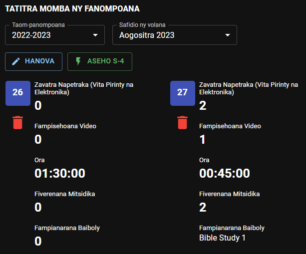

# Tatitra Momba ny Fanompoako

Afak mijery, manova ary mandefa ny tatitra momba ny fanompoanao ianao ato amin’ity fizarana ity.

## Firaketana ny fanompoana mandritra ny volana

Rehefa hampiditra tatitra, dia safidio alohan ny taom-panompoana sy ny volana tianao hampidirana an’ilay izy.

- Tsindrio avy eo ilay hoe **Hanova.**

- Misafidiana **Daty.**

- Enter each item accordingly. All the changes you made are automatically saved.

  

- Tsindrio ilay hoe **Afenina** raha tsy tianao hiseho io fampidirana tatitra momba ny fanompoana io.

### Fanisana Ora - CPE

CPE can be used as a stopwatch to record the time you spent in the field ministry. To start the timer, click the **_Start_** icon. To pause, click the **_Pause_** icon. You can resume it later if needed. And to stop the timer, click the **_Stop_** icon.

### Fampianarana Baiboly

This entry will use your [Bible Study records](./my_bible_studies). If no record appears, please make sure you have active Bible Studies records.

### Hamafa tatitra

Raha hamafa ny firaketana ny tatitra momba ny fanompoana ho an’ny andro anankiray, dia karohy eo amin’ilay lisitra ilay tatitra, dia tsindrio avy hoe ilay sary kely hoe ***Hamafa***.

## Tatitra Momba ny Fanompoana S-4

- Tsindrio ilay hoe **Aseho (S-4)** raha te hikajy sy hampiseho ny tatitra momba ny fanompoana ho an’ilay volana.

  

- Tsindro ilay hoe **Afenina (S-4)** raha tsy tianao hiseho ny tatitra S-4.

### Handefa tatitra

- Raha ilaina, dia ampidiro ny fanamarihana momba ny tatitrao.
- Tsindrio avy eo ilay hoe **Handefa S-4** mba handefasana ny tatitrao any amin’ny Mpitan-tsoratra.

:::info

It will no longer be possible to edit the daily record when the S-4 report is submitted. If changes are necessary, undo the submission.

:::

### Hanamarika tatitra hoe tsy lasa

- Raha efa lasa ny tatitrao, nefa misy fanovana mila atao, dia tsindrio ilay hoe **Marihina hoe Tsy Lasa.** Ampidiro avy eo ilay fanovana mila atao.

  

- Tsindrio indray avy eo ilay hoe **Handefa S-4** mba handefasana an’ilay tatitra any amin’ny Mpitan-tsoratra.

:::caution

Tsy azo marihina hoe tsy lasa intsony ny tatitra S-4 raha efa nohamarin’ny Mpitan-tsoratra sy nekeny.

:::
