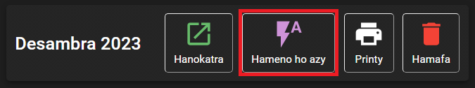

# Fivoriana Andavanandro

Ato amin’ity pejy ity no hanaovana ny fanendrena rehetra amin’ny fivoriana andavanandro.

## Hanendry olona

Jereo eo amin’ilay lisitra hoe inona ilay fandaharana tianao amboarina. Misy fomba roa azonao ampiasaina avy eo mba hanaovana ny fanendrena:

### Hameno ho azy

- Tsindrio ilay hoe **Hameno ho azy.**

  

- Hisy hafatra hipoitra avy eo, dia tsindrio ilay hoe **HAMENO HO AZY** raha hanohy.

  

:::info

**Tsy ho** voasolo ireo anjara efa vita fanendrena rehefa mameno ho azy fandaharana ianao.

Manamora ny asa ilay hoe afaka fenoina ho azy ny fandaharana. Matoky anefa izahay hoe hahay handinika sy handanjalanja ianao rehefa mampiasa azy io mba hanaovana ny fanendrena. 😉

:::

### Hanendry anjara tsirairay

- Tsindrio ilay **Hanokatra.**

  

- Hisy pejy hamintina ny fanendrena rehetra amin’ilay volana avy eo hipoitra:

  

  Tsindrio ilay hoe **HANOVA** eo akaikin’ilay herinandro tianao hanaovana fanendrena.

- Safidio amin’izay avy eo ny olona tendrenao amin’ny anjara tsirairay. Mariho azafady ireto fanazavana manaraka ireto rehefa manendry tsirairay ianao:

  - Rehefa misafidy olona hanao anjara hafa ankoatran’ny anjaran’ny mpianatra ianao, dia ny daty farany nanaovany an’io anjara io no miseho eo amin’ilay **Anjara farany.**

    

    Ny daty nanendrena an’ireo rahalahy ireo ho Mpitari-draharaha farany izao no aseho eo amin’ilay ohatra eo ambony.

  - Rehefa hanendry ny anjaran’ny mpianatra ianao, dia afaka misafidy na hanendry **Lahy** na **Vavy.** Ny daty nanaovan’ilay mpianatra mpitarika farany no aseho eo amin’ilay **Anjara farany,** na inona na inona karazan’ilay anjara. Ny daty nanendrena azy farany ho mpanampy kosa no aseho eo amin’ilay **Mpanampy.**

    

  - Tsy ho afaka hanendry ny mpanampy amin’ny anjaran’ny mpianatra mihitsy ianao, raha tsy efa voatendry aloha ny mpitarika.

  - Tsindrio ilay sary _Tsipiriany_ raha hijery ny anjara rehetra nanendrena an’ilay olona.

    

    Hiseho ity lisitra ity avy eo:

    

    Rehefa mijery ny anjara rehetra efa nanendrena ny mpanampy amin’ny anjaran’ny mpianatra ianao, dia hiseho eo koa ny lisitry ny mpanampy rehetra efa niara-nanao anjara tamin’ilay mpitarika:

    

  - Tsindrio ilay **x** eo akaikin’ny anaran’ilay olona raha tsy hanendry azy indray.

    

  - Tsy mila olona tendrena hanao azy ny anjara sasany amin’ny fivoriana, ohatra hoe zava-bitan’ny Fandaminana, sns...

  - Ny lisitry ny anti-panahy ihany no hiseho rehefa misy anjara sasany tokony hataon’ny anti-panahy, ohatra hoe zavatra ilain’ny Fiangonana, sns...

  - Ampiasao ilay hoe _Handeha eo aloha_ na _Hiverina any aoriana_ eny amin’ny farany ambony indrindra amin’ny pejy raha hanova ny herinandro hanaovana fanendrena.

    

## Hamafa fanendrena

- Raha tianao fafana ny fanendrena rehetra amin’ilay volana:

  - Tsindrio ilay hoe **Hamafa.**

    

  - Hisy hafatra hipoitra avy eo, dia tsindrio ilay hoe **HAMAFA** raha hanohy.

    

- Raha tianao fafana ny fanendrena rehetra amin’ny herinandro iray:

  - Tsindrio ilay **Hanokatra.**

    

  - Rehefa misokatra ilay pejy mamintina ny fanendrena rehetra amin’ilay volana, dia tsindrio ilay hoe **HAMAFA** eo akaikin’ilay herinandro misy ny fanendrena tianao hofafana.

    

  - Hisy hafatra hipoitra avy eo, dia tsindrio ilay hoe **HAMAFA** raha hanohy.

    

## Hanao printy fandaharana

### Fanomezana Anjara S-89

- Tsindrio ilay hoe **Printy,** dia safidio avy eo ilay hoe **Fanomezana Anjara S-89.**

  

- Safidio hoe herinandro sa anjara inona avy no tianao ho atao printy, dia tsindrio ilay hoe **HIJERY MIALOHA.**

  

- Rehefa vita ny fanamboarana an’ilay S-89 jerena mialoha, dia tsindrio ilay hoe **PDF** raha hitahiry an’ilay S-89 amin’ny endrika PDF.

  

### Fandaharam-pivoriana Andavanandro (S-140)

- Tsindrio ilay hoe **Printy,** dia safidio avy eo ilay hoe **Fandaharam-pivoriana Andavanandro.**

  

- Miankina amin’ny fitaovana ampiasainao avy eo ny hoe ho voatahiry avy hatrany ao amin’ny fitaovana ampiasainao ilay PDF, na hisy hafatra hanasa anao hisafidy ny toerana asiana azy.
