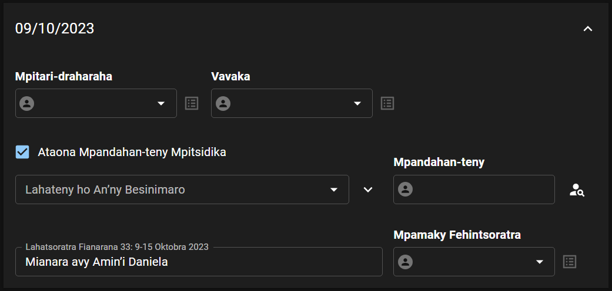

# Weekend Meeting

Here is the section where you will manage the meeting parts for the weekend meeting.

## Hanendry olona

### Hameno ho azy

- Click the **AUTOFILL** button at the top of the page.

  

- Select the starting and ending dates you want to autofill, and click **CONTINUE** to confirm.

  

:::info

**Tsy ho** voasolo ireo anjara efa vita fanendrena rehefa mameno ho azy fandaharana ianao.

Manamora ny asa ilay hoe afaka fenoina ho azy ny fandaharana. Matoky anefa izahay hoe hahay handinika sy handanjalanja ianao rehefa mampiasa azy io mba hanaovana ny fanendrena. 😉

:::

### Hanendry anjara tsirairay

- Locate from the list and expand the week you want edit.

  

- Choose a person to assign for each meeting part. Please note the following when doing manual assignment:

  - The **last assignment** column is the last time this person was assigned for the same part.

    

    Ny daty nanendrena an’ireo rahalahy ireo ho Mpitari-draharaha farany izao no aseho eo amin’ilay ohatra eo ambony.

  - When you select a speaker delivering only a symposium talk, a new field will appear automatically to assign the next speaker.

    

  - Tsindrio ilay sary _Tsipiriany_ raha hijery ny anjara rehetra nanendrena an’ilay olona.

    

    Hiseho ity lisitra ity avy eo:

    

  - Tsindrio ilay **x** eo akaikin’ny anaran’ilay olona raha tsy hanendry azy indray.

    

### Assign visiting speaker

- Locate from the list and expand the week you want assign a visiting speaker.

- Check the **Delivered by Visiting Speaker** checkbox.

  

- Click the _Find_ icon to find for a visiting speaker.

  

- Choose the speaker and talk by clicking the _Assign_ icon.

  

- To remove an assigned visiting speaker, click the _Find_ icon next to his name. Then click the _Remove_ icon.

  

## Hamafa fanendrena

- Click the **DELETE** button at the top of the page.

  

- Select the starting and ending dates you want to delete, and click **CONTINUE** to confirm.

  

## Export schedule to PDF

- Click the **EXPORT** button at the top of the page.

  

- Select the starting and ending dates you want to export, and click **CONTINUE** to confirm.

  

- Miankina amin’ny fitaovana ampiasainao avy eo ny hoe ho voatahiry avy hatrany ao amin’ny fitaovana ampiasainao ilay PDF, na hisy hafatra hanasa anao hisafidy ny toerana asiana azy.
