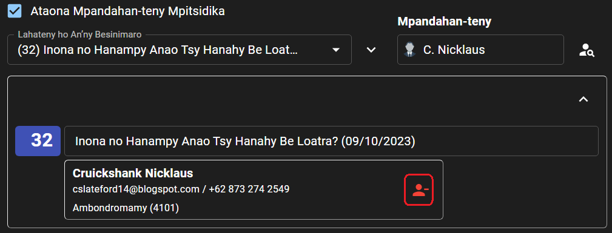

# Fivoriana Faran’ny Herinandro

Ato amin’ity pejy ity no hanaovana ny fanendrena rehetra amin’ny fivoriana faran’ny herinandro.

## Hanendry olona

### Hameno ho azy

- Tsindrio ilay hoe **HAMENO HO AZY** eny amin’ny farany ambony amin’ilay pejy.

  

- Safidio hoe manomboka aiza ka hatraiza ny herinandro tianao hofenoina ho azy, dia tsindrio ilay hoe **HANOHY.**

  

:::info

**Tsy ho** voasolo ireo anjara efa vita fanendrena rehefa mameno ho azy fandaharana ianao.

Manamora ny asa ilay hoe afaka fenoina ho azy ny fandaharana. Matoky anefa izahay hoe hahay handinika sy handanjalanja ianao rehefa mampiasa azy io mba hanaovana ny fanendrena. 😉

:::

### Hanendry anjara tsirairay

- Jereo eo amin’ilay lisitra sy sokafy ny herinandro tianao ovaina.

  

- Safidio amin’izay avy eo ny olona tendrenao amin’ny anjara tsirairay. Mariho azafady ireto fanazavana manaraka ireto rehefa manendry tsirairay ianao:

  - Ny daty nanaovan’ilay olona an’io anjara io farany no aseho eo amin’ilay hoe **Anjara farany.**

    

    Ny daty nanendrena an’ireo rahalahy ireo ho Mpitari-draharaha farany izao no aseho eo amin’ilay ohatra eo ambony.

  - Rehefa manendry mpandahan-teny manao ampahana lahateny ianao, dia hisy toerana azonao hisafidianana ny manao ny tapany farany amin’ilay lahateny hipoitra.

    

  - Tsindrio ilay sary _Tsipiriany_ raha hijery ny anjara rehetra nanendrena an’ilay olona.

    

    Hiseho ity lisitra ity avy eo:

    

  - Tsindrio ilay **x** eo akaikin’ny anaran’ilay olona raha tsy hanendry azy indray.

    

### Hanendry mpandahan-teny mpitsidika

- Jereo eo amin’ilay lisitra sy sokafy ny herinandro tianao hanendrena mpandahan-teny mpitsidika.

- Asio marika ilay hoe **Ataona Mpandahan-teny Mpitsidika.**

  

- Tsindrio ilay sary _Hikaroka_ mba hitadiavana ny mpandahan-teny mpitsidika.

  

- Tsindrio ilay sary _Hanendry_ mifanandrify amin’ilay mpandahan-teny sy ny lahateny ho ataony.

  

- Raha hamafa ny fanendren’ny mpandahan-teny mpitsidika, dia tsindrio ilay sary _Hikaroka_ eo akaikin’ny anarany. Tsindrio avy eo ilay sary _Hamafa._

  

## Hamafa fanendrena

- Tsindrio ilay hoe **HAMAFA** eny amin’ny farany ambony amin’ilay pejy.

  

- Safidio hoe manomboka aiza ka hatraiza ny herinandro tianao hofafana, dia tsindrio ilay hoe **HANOHY.**

  

## Hamoaka ny fandaharana ho PDF

- Tsindrio ilay hoe **PRINTY** eny amin’ny farany ambony amin’ilay pejy.

  

- Safidio hoe manomboka aiza ka hatraiza ny herinandro tianao ho atao PDF, dia tsindrio ilay hoe **HANOHY.**

  

- Miankina amin’ny fitaovana ampiasainao avy eo ny hoe ho voatahiry avy hatrany ao amin’ny fitaovana ampiasainao ilay PDF, na hisy hafatra hanasa anao hisafidy ny toerana asiana azy.
