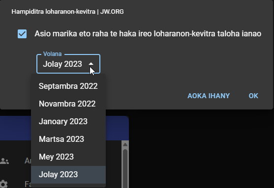
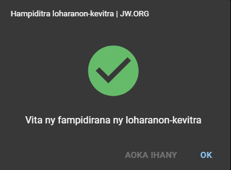

# Haka Any Amin’ny JW.ORG

Raha mampiasa CPE amin’ny fitaovana afaka hanaovana internet ianao, dia ity no ampirisihinay ampiasaina mba hampidirina an’ireo loharanon-kevitra. Sokafy avy ny CPE, dia tsindrio ilay hoe **Haka Any Amin’ny JW.ORG**, eo ambanin’ilay karatra hoe Loharanon-kevitra.

## Hampiditra ny loharanon-kevitra ampiasaina amin’izao

Tsindrio ny OK, raha hampiditra ny loharanon-kevitra ampiasaina amin’izao ihany ianao. Ny loharanon-kevitra ao amin’ny Tari-dalana ampiasaina amin’izao sy amin’ny ho avy izany.

:::caution

Ataovy azo antoka hoe tsy misy marika eo amin’ilay hoe **Asio marika eto raha te haka ireo loharanon-kevitra taloha ianao.**

:::

## Hampiditra loharanon-kevitra taloha

Raha hampiditra ny loharanon-kevitra avy amin’ny Tari-dalana taloha ianao, dia asio marika ilay hoe **Asio marika eto raha te haka ireo loharanon-kevitra taloha ianao.** Safidio avy eo hoe ny volana inona no tianao hampidirina, dia tsindrio ny OK.

Haka an’ireo loharanon-kevitra any amin’ny jw.org ny CPE. Hisy hafatra hiseho avy eo hanamafy fa vita ny fampidirana ny loharanon-kevitra. Tsindrio ny OK.

