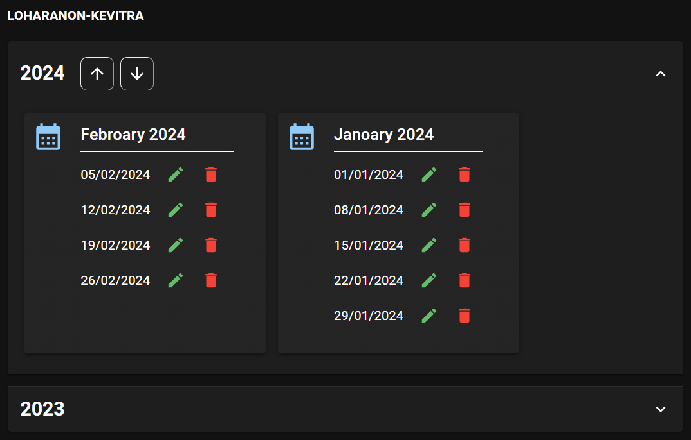
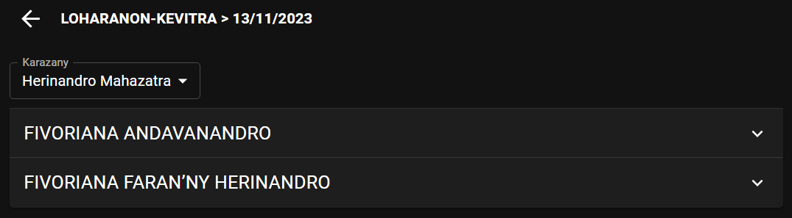
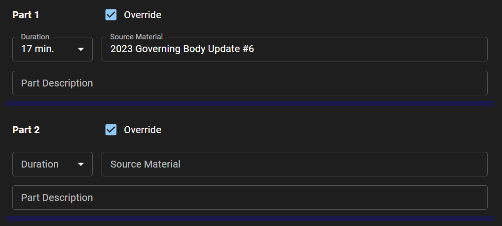
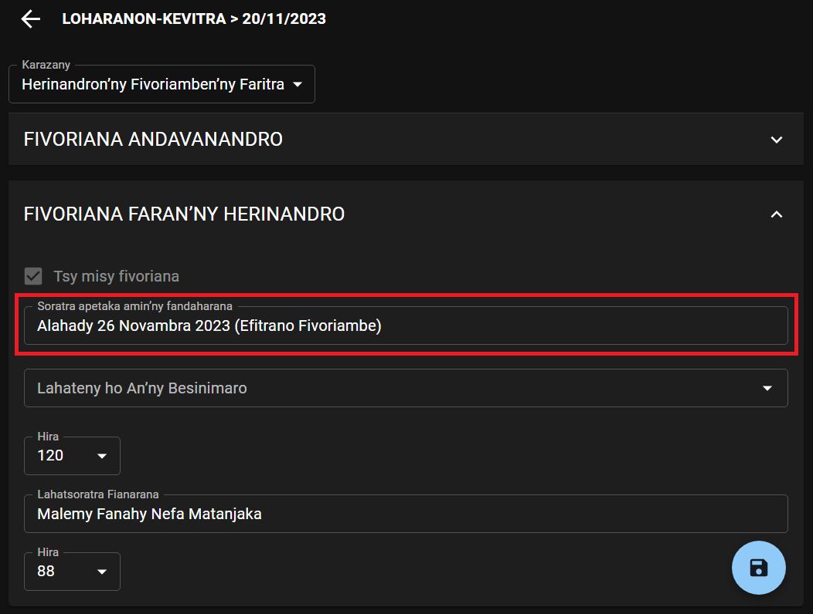
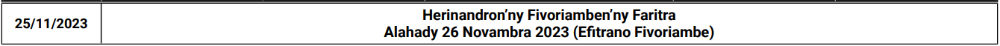

# Hijery Loharanon-kevitra

## Hanova loharanon-kevitra ho an’ny herinandro

- Tsindrio ilay sary _Pensilihazo_ eo akaikin’ilay herinandro tianao ovana. Hisokatra ity pejy ity avy eo:

  

- Ampidiro ny fanovana rehetra ilaina, dia tsindrio avy eo ilay sary _Hitahiry_ mba hitehirizana ny fanovana nataonao.

### Hanolo anjara ao amin’ny Fiainantsika Kristianina

Izao hatao raha mila ovana ny anjara ao amin’ny Fiainantsika Kristianina:

- Sokafy ilay fizarana hoe FIVORIANA ANDAVANANDRO.

- Jereo ilay anjara mila ovana, eo ambanin’ilay hoe Ny Fiainantsika Kristianina, ary asio marika ilay hoe **Soloana.**

  

  Nasiana marika hoe **Soloana** koa ilay anjara faharoa eo amin’ny ohatra eo ambony io satria nofoanana ilay izy.

- Amboary ny fotoana hanaovana ny anjara sasany. Tsy tokony hihoatra ny 45 min ny fitambarany.

  

### Soratra fanampiny aseho amin’ny fandaharam-pivoriana faran’ny herinandro rehefa tsy misy fivoriana

- Sokafy ilay fizarana hoe FIVORIANA FARAN’NY HERINANDRO.

- Ampidiro eo amin’ilay hoe **Soratra apetaka amin’ny fandaharana** ilay soratra.

  

  Hoatran’izao avy eo no hiseho eo amin’ny fandaharana:

  

## Hamafa herinandro

- Tsindrio ilay sary _Hamafa_ eo akaikin’ilay herinandro raha tianao hofafana ao amin’ny loharanon-kevitra ilay izy.
