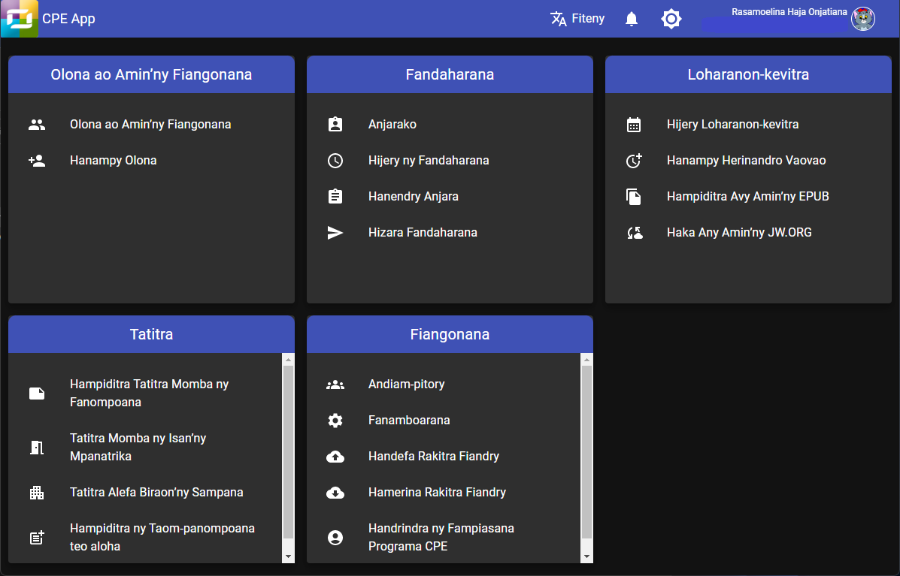

# Mombamomba ny CPE

Congregation Program for Everyone or CPE, is an application developped by the Scheduling Workbox System team. It is web application designed for use by anyone in the congregation of Jehovah’s Witnesses.

## Programa ofisialy avy amin’ny fandaminana ve ny CPE?

No, it is not. You are free to choose whether to use our applications or not. But we strongly recommend all the congregation elders approved their use. Also, we are aware that there are many similar applications currently available to help you to accomplish similar tasks. We are not here to say what is the best and what is not. We believe all of these applications are good and have their own methods on how to do things, but still share the same goal.

## Fa maninona no namorona programa, antsoina hoe _web application_ izahay?

Mino izahay hoe betsaka kokoa ny tombony azo amin’ny fampiasana _web application_ raha oharina amin’ny programa tsy maintsy mila ordinatera foana. Afaka manokatra _web application_ foana mantsy ianao na inona na inona fitaovana ampiasainao, ka manana programa fijerena internet. Mety foana na mampiasa Windows ianao, na Mac, na Linux, na telefaonina entin-tanana. Fantatray koa anefa hoe misy olana vitsivitsy ampoizina hoe hitranga rehefa mampiasa _web application_. Tianay anefa ny hanome toky anao hoe miezaka manao izay fara herinay izahay mba hiarovana an’ireo programa ampiasainay. Miezaka izahay mba haharaka an’ireo fanovana sy zava-baovao farany, mba hanomezana anao programa azo atokisana tsara.
