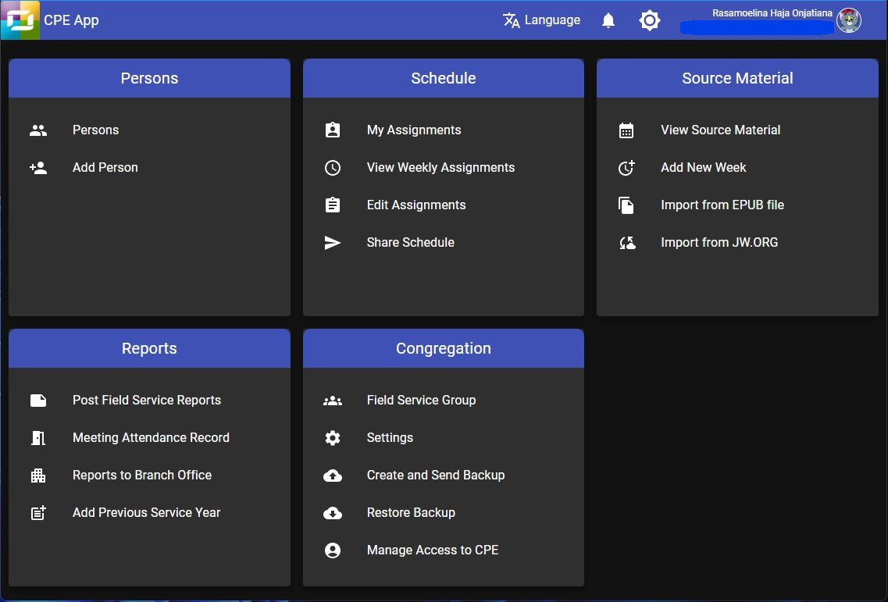

# Mombamomba ny CPE

Programa namboarin’ny ekipan’ny Scheduling Workbox System ny CPE na _Congregation Program for Everyone._ Programa natao ampiasain’ny rehetra ao amin’ny fiangonanan’ny Vavolombelon’i Jehovah izy io.

## Programa ofisialy avy amin’ny fandaminana ve ny CPE?

Tsia. Azonao atao tsara ny misafidy na hampiasa an’ireo programa namboarinay ianao na tsia. Tsara kokoa raha efa manaiky ny hampiasana ny programa namboarinay ny anti-panahy rehetra ao amin’ny fiangonana. Fantatray koa fa be dia be amin’izao ny programa mitovitovy amin’ireo amboarinay mba hanampy anao hamita ny andraikitrao. Tsy anjaranay mihitsy no hiteny hoe iza no tsara na ratsy. Matoky izahay hoe tsara daholo ireny programa rehetra ireny. Marina fa mety tsy hitovy ny fomba hanaovana zavatra anankiray ao amin’izy ireny, fa mitovy daholo kosa ny tanjona tiana hotratrarina.

## Fa maninona no namorona programa, antsoina hoe _web application_ izahay?

Mino izahay hoe betsaka kokoa ny tombony azo amin’ny fampiasana web application raha oharina amin’ny programa tsy maintsy mila ordinatera foana. Afaka manokatra web application foana mantsy ianao na inona na inona fitaovana ampiasainao, ka manana programa fijerena internet. Mety foana na mampiasa Windows ianao, na Mac, na Linux, na telefaonina entin-tanana. Fantatray koa anefa hoe misy olana vitsivitsy ampoizina hoe hitranga rehefa mampiasa web application. Tianay anefa ny hanome toky anao hoe miezaka manao izay fara herinay izahay mba hiarovana an’ireo programa ampiasainay. Miezaka izahay mba haharaka an’ireo fanovana sy zava-baovao farany, mba hanomezana anao programa azo atokisana tsara.