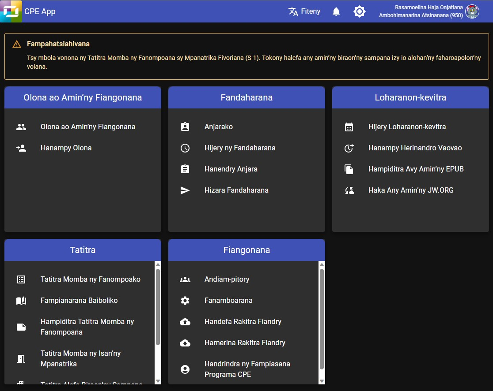

# Mombamomba ny CPE

Programa namboarin’ny ekipan’ny Scheduling Workbox System ny CPE na _Congregation Program for Everyone._ Programa natao ampiasain’ny rehetra ao amin’ny fiangonanan’ny Vavolombelon’i Jehovah izy io.

## Programa ofisialy avy amin’ny fandaminana ve ny CPE?

Tsia. Azonao atao tsara ny misafidy na hampiasa an’ireo programa namboarinay ianao na tsia. Tsara kokoa raha efa manaiky ny hampiasana ny programa namboarinay ny anti-panahy rehetra ao amin’ny fiangonana. Fantatray koa fa be dia be amin’izao ny programa mitovitovy amin’ireo amboarinay mba hanampy anao hamita ny andraikitrao. Tsy anjaranay mihitsy no hiteny hoe iza no tsara na ratsy. Matoky izahay hoe tsara daholo ireny programa rehetra ireny. Marina fa mety tsy hitovy ny fomba hanaovana zavatra anankiray ao amin’izy ireny, fa mitovy daholo kosa ny tanjona tiana hotratrarina.

## Fa maninona no namorona programa, antsoina hoe _web application_ izahay?

We believe that moving from desktop application to web application offers more advantages and flexibility. Web applications do not depend on system or hardware specifications. You can launch them from any platform or device that has a browser. It doesn’t matter whether you work with Windows, Mac, Linux, or a Smartphone. However, we also understand that there are some security risk involved when using web application. But be assured that we are doing our best to secure our application. We try to be up to date with all changes and developments in web technologies to provide you an application that you can rely on.
