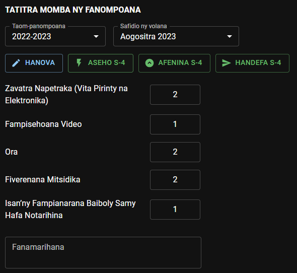
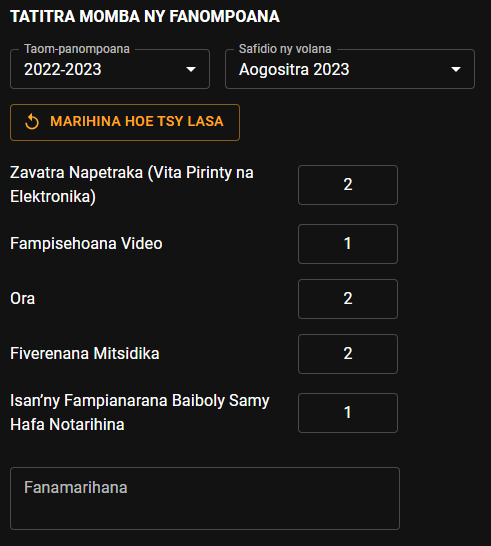

# Tatitra Momba ny Fanompoako

Afak mijery, manova ary mandefa ny tatitra momba ny fanompoanao ianao ato amin’ity fizarana ity.

## Firaketana ny fanompoana mandritra ny volana

Rehefa hampiditra tatitra, dia safidio alohan ny taom-panompoana sy ny volana tianao hampidirana an’ilay izy.

- Tsindrio avy eo ilay hoe **Hanova.**

- Misafidiana **Daty.**

- Ampidiro avy eo ny tatitrao. Tonga dia voatahiry avy hatrany izay tarehimarika ampidirinao.

  

- Tsindrio ilay hoe **Afenina** raha tsy tianao hiseho io fampidirana tatitra momba ny fanompoana io.

### Fanisana Ora - CPE

Afaka ampiasaina mba hanisana ny ora nanaovana ny fanompoana koa ny CPE. Tsindrio ilay sary **_Handefa_** kely, mba handefasana an’ilay fanisana ora. Tsindrio ilay sary **_Hampiato_** kely, raha te hampiato an’ilay fanisana ora ianao. Azonao averina alefa indray ilay izy avy eo raha ilaina. Tsindrio ilay sary **_Hajanona_** kely, raha hanajanona an’ilay fanisana ora.

### Fampianarana Baiboly

Ny lisitra avy any amin’ny [firaketana momba ny mpianatra Baibolinao](./my_bible_studies) no ampiasaina eto. Raha tsy misy anarana miseho eto, dia ataovy azo antoka hoe manana firaketana momba ny mpianatra Baiboly mbola ampiasaina ianao.

### Hamafa tatitra

Raha hamafa ny firaketana ny tatitra momba ny fanompoana ho an’ny andro anankiray, dia karohy eo amin’ilay lisitra ilay tatitra, dia tsindrio avy hoe ilay sary kely hoe ***Hamafa***.

## Tatitra Momba ny Fanompoana S-4

- Tsindrio ilay hoe **Aseho (S-4)** raha te hikajy sy hampiseho ny tatitra momba ny fanompoana ho an’ilay volana.

  

- Tsindro ilay hoe **Afenina (S-4)** raha tsy tianao hiseho ny tatitra S-4.

### Handefa tatitra

- Raha ilaina, dia ampidiro ny fanamarihana momba ny tatitrao.
- Tsindrio avy eo ilay hoe **Handefa S-4** mba handefasana ny tatitrao any amin’ny Mpitan-tsoratra.

:::info

Tsy ho afaka hanova ny tatitra momba ny fanompoanao mandritra ny volana intsony ianao rehefa lasa any amin’ny Mpitan-tsoratra ny tatitra S-4. Raha misy fanovana mila atao, dia mila marihinao hoe tsy lasa indray aloha ilay tatitra.

:::

### Hanamarika tatitra hoe tsy lasa

- Raha efa lasa ny tatitrao, nefa misy fanovana mila atao, dia tsindrio ilay hoe **Marihina hoe Tsy Lasa.** Ampidiro avy eo ilay fanovana mila atao.

  

- Tsindrio indray avy eo ilay hoe **Handefa S-4** mba handefasana an’ilay tatitra any amin’ny Mpitan-tsoratra.

:::caution

Tsy azo marihina hoe tsy lasa intsony ny tatitra S-4 raha efa nohamarin’ny Mpitan-tsoratra sy nekeny.

:::
