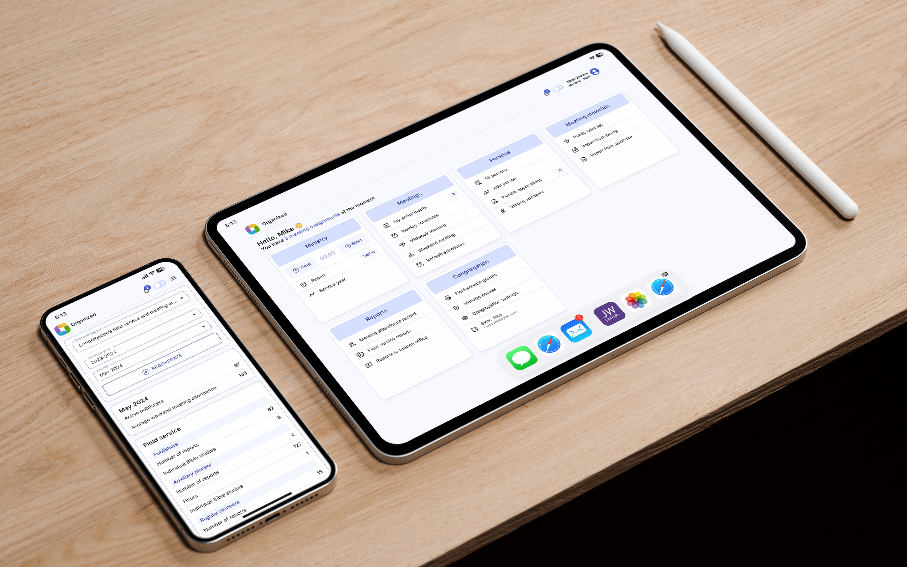
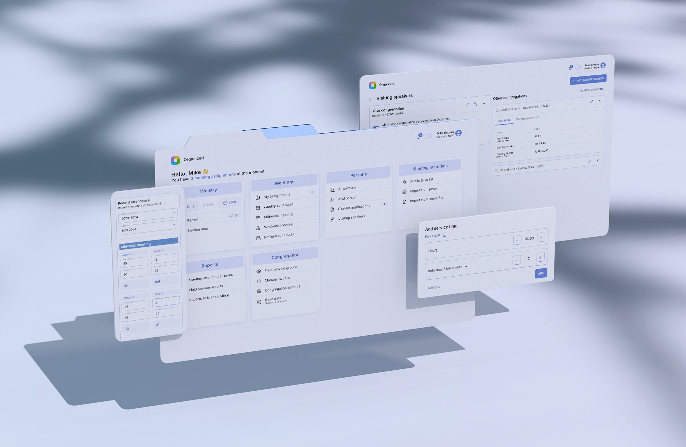

---

title: Say hello to Organized – your reliable theocratic assistant
date: 2024-05-01T10:00
description: Simplify your Jehovah's Witnesses meetings scheduling tasks with Organized, the free web app for assignments, schedules, ministry and reports. Save time, reduce stress, and enjoy using the app. Discover the benefits and try Organized app right now!
keywords: [Organized app, Jehovah's Witnesses, congregation management, what is Organized, assignments, schedules, reports, theocratic duties, time-saving, stress-free, jw.org fetch, jw congregation]
slug: say-hello-to-Organized
tags: [introduction, update]
hide_table_of_contents: false
---

<iframe width="560" height="315" src="https://www.youtube.com/embed/2czQB-LEfqg?start=15&autoplay=0" frameborder="0" allow="accelerometer; clipboard-write; encrypted-media; gyroscope; picture-in-picture" allowFullScreen></iframe>

### Organized introduction: Say hello to your new theocratic assistant

Say goodbye to stress and say hello to a improved approach to managing your Jehovah's Witnesses congregation's life and responsibilities. Introducing the Organized app, a reliable and efficient theocratic assistant for the whole congregation! This free app will be a great companion for any person – appointed brothers, pioneers, publishers and even midweek meeting students! Let's dive a little bit deeper and learn how Organized app can help you!

{/* truncate */}

### Is there such a need at all?

Our congregations consist of tens of hard-working brothers and sisters who put in a lot of effort to serve Jehovah and dedicate many hours each month to the preaching work and encouraging fellow members of their congregation. Elders and ministerial servants also work hard to care for their congregations and serve them. This involves a lot of effort and time on their part. They care for and watch over the well-being and joy of the congregation, maintain the local Kingdom Hall, organize the local preaching work, including territories, campaigns, and public witnessing, deliver field service meetings, organize schooling for publishers, handle all congregation reporting and documentation, and schedule our weekly meetings, which serve as a source of spiritual strength and mutual encouragement! And that's definitely not the complete list of their respoinsibilities.

If you serve as an elder, ministerial servant, or are appointed as their assistant, you know well how much joy this service brings. It's an opportunity to serve our God Jehovah and our dear brothers and sisters. However, managing multiple responsibilities, such as creating meeting schedules, managing 
student assignments, analyzing and creating reports, and scheduling Kingdom Hall maintenance can be challenging. Of course, this is the 'scheme or work from God', and that's why it will surely be successful. But it still takes time and often involves manual work, such as copying and pasting information, manual calculations, hours of analyzing to prepare accurate reports, and other tasks. Furthermore, the smaller a congregation is, the more responsibilities fall on the shoulders of one brother. Therefore, in our view, the smaller the congregation, the more support it needs.

We've also faced these challenges in our service... That's why we've came up with an idea to delegate routine tasks to the computer and let brothers focus on the important parts that require a human touch, focus, warm love, and care for Jehovah's sheep.

### An app crafted specifically for Jehovah's Witnesses congregations

Some time ago, our small team began exploring ways to simplify meeting scheduling. We asked ourselves, _"What if we could automatically retrieve the midweek meeting program part titles directly from the digital version of our meeting workbook?"_ Month after month, we developed software tools to help meeting overseers carry out their responsibilities more efficiently. This has began locally, to support domestic congregations that had a need.

Our goal is not to replace these brothers with an app, but rather to assist them in their work, enabling them to spend less time at a desk with a paper or computer and freeing up more time for family, ministry, or getting to know publishers in their congregations better. This is the core goal we aim to achieve with our software!

As the months went by, our software improved through collaboration with various brothers who had different assignments in the congregation. The app gained more functionality and enabled brothers to complete tasks in minutes that used to take hours, with greater accuracy and joy. We experimented with different formats and names for our app, starting with automated Excel sheets, then moving to a desktop application, and now we have further improved it to a web application that works on any modern operating system. 

Over the past year, we've expanded our team of enthusiastic brothers and sisters, dedicating our time to building an app that doesn't require extra knowledge, experience, or effort to use. Instead, we're focused on creating an app that is user-friendly and easy to recommend to others. We put a lot of effort to creating a richly functional app with uncompromising security, all wrapped up in a beautiful user interface design and providing a pleasant user experience. The app is constantly improving through feedback from users in different parts of our theocratic world, continuous consultation with appointed brothers, and review of the latest directions from the Jehovah's Witnesses organization.

### Meet your all-in-one solution: The Organized App

Today, our app called Organized is available worldwide. Its goal remains the same – to improve the scheduling workflow of the entire congregation and reduce stress levels for everyone who uses it, from appointed brothers to publishers and "Our Life and Ministry" meeting students.

Organized is an all-in-one hub for many processes happening within each congregation. Its approach is straightforward and easy:

1. **Prepare:** Create your congregation, add persons, set roles, invite other users;
2. **Use:** Schedule meetings, fetch meeting programs from jw.org in one click, track ministry time, generate and submit reports, view upcoming assignments;
3. **Enjoy:** Schedules will be visible to everyone in your congregation, and after a few tries, scheduling process will take only a few minutes to complete. Publishers will always have up-to-date schedules and assignment information.

The app is incredibly easy to use! By simply entering the required information in a timely and consistent manner, you won't need to worry about creating correct reports about congregation, ministry, and meeting attendance. Organized will calculate all of that in a matter of seconds and present you with a report that is ready to be submitted on the JW Hub. Having a single database for the whole congregation also ensures more accurate historical data, readily accessible emergency contact information, more thoughtful assignment distribution, and quick and accurate reports. Organized app – is a one place where you can find everything you need, depending on your spiritual status and responsibility.

At the moment, the app's most used functionality is midweek and weekend meeting scheduling – creating assignments for both responsible brothers and students. However, we're actively working on expanding the feature list to cover as many congregation operations as possible, including the territories management, scheduling of public witnessing, meeting duties, field service meetings, upcoming events, hall cleaning, congregation activities, and exporting more printed schedules and forms like S-12, S-13, S-21, S-99, and S-140.

We published the Organized app on [GitHub](https://github.com/sws2apps/organized-app), where it has gathered many collaborators. Organized is an open-source project, which means that we are 100% transparent about how it works in the background, and we welcome collaboration from enthusiastic brothers and sisters who wish to contribute. What started as a local project has now expanded globally, and we're happy to support so many congregations worldwide, especially those in greatest need!

### Why Organized is different

Organized is not the first in-a-kind app that aims to facilitate the scheduling and reporting for congregations. Of course, there are different solutions: some apps are focused only on one area _(for example, territories management or ministry)_ while other are similar all-in-one solutions. We're not trying to judge or compare which app is best. We offer a test mode that lets you try all the app's features without registration, using a pre-filled test environment with mock congregation and person data. However, before using the actual Organized app, please discuss it with your body of elders first.

Let us tell you about key differentiation aspects of Organized, that we find the most important.

- **Free for everyone:** The app is available to everyone at no cost, making it accessible to all congregations regardless of their financial resources. This is important because it ensures that all congregations have access to the same tools to help them manage their activities efficiently.
- **Accessible:** The app has been fully or partially translated into over 30 languages, making it accessible to thousands of congregations in the language that resonates with their hearts. In case you discover that Organized is not yet available in your language, you can request it on our GitHub page and contribute to the translation. By doing so, you'll help make the app available to even more brothers and sisters.
- **Open-source code with full transparency:** Organized is an open-source project build with modern technologies, meaning that its code is publicly available for anyone to view and improve, while we strongly moderate every change. This transparency ensures that the app is secure, reliable, and trustworthy, and it allows for collaborative development.
- **User-centered and design-first approach:** The app is designed with the user in mind, focusing on how we can fulfill their needs. We created it with a beautiful and intuitive interface that is easy to use. This approach required hundreds of hours and revisions just for the design, but it ensures that the app is user-friendly, reduces the learning curve, and makes it more accessible to our global brotherhood of all ages and technical abilities.
- **Easy and convenient to use:** Organized is designed to be simple and straightforward to use, with all the features accessible directly from the home page and logically grouped. Both the scheduling and viewing processes are designed to be quick and effortless. Each user sees only the features that are relevant to them. This ease of use not only saves time but also makes it a pleasure to check for new schedules and assignments, and to use the app overall.
- **Cross-platform functionality:** As a Progressive Web App (PWA), Organized offers full functionality on multiple platforms, including web, desktop, and mobile devices. This means that users can access the app from anywhere, at any time, and on any modern device with an internet connection. This provides much-needed flexibility, ensuring nobody is restricted to a specific device or operating system. This is particularly important in Jehovah's organization, where responsibilities can be passed on to different brothers at any time. With the ability to access the app from any device, the new brother can easily take over and continue with the tasks at hand, without a need to search for new software solutions and starting from the scratch.
- **An active team dedicated to constantly improving the app:** The team behind Organized is committed to continuously improving the app. What began as a one-person project has now grown into a team of devoted brothers and sisters who love Jehovah and our spiritual family. With a team approach, the project is no longer reliant on a single person, ensuring that it will not be neglected. You can rest assured that the Organized app will be supported and kept up-to-date with the latest directions from the Governing Body for the whole lifetime of the app.

For us, it is essential that the app adheres to all of the following criteria. This is our guiding principle when it comes to developing and refining Organized. 

### Trusted and tested: Discover why others love Organized

One of our initial goals was to create an app that we ourselves would love to use, and it brings us real joy to be able to share it with others! We truly appreciate the feedback provided by brothers and sisters about Organized. Midweek meeting students appreciate being able to see all their upcoming assignments at a glance, pioneers love the ministry timer and Bible studies list, and elders enjoy the speed and quality of scheduling meetings. Let's see what some of them says:

> Now it's way faster and easier for me to create schedules for the whole month. It now takes me only a couple of minutes, so I can participate in ministry and congregation activities more! We now use less paper and all of the congregation info is easy to find by both publishers and responsible brothers.
>
> — Andrew, "Our Christian Life and Ministry" meeting overseer

> Organized has significantly simplified the process of creating weekend schedules for my congregation. As someone who collaborates with many other congregations, I find the visiting speakers feature to be incredibly valuable. The app automatically provides the name of the Watchtower study article and songs, so all I need to do is select a public talk and its corresponding song. The print template looks amazing! With Organized, creating a schedule is as simple as selecting the date, talk, speaker, and song, then exporting it. In just a few clicks, the schedule is published in the app and ready to be printed for our information board!
>
> — Steve, public talk overseer

> It's fantastic to have one app where I can keep track of my ministry time, add Bible studies, and then submit service reports seamlessly at the end of the month with a few clicks. It's a great addition to the easily accessible schedules and my next meeting assignments, so I don't have to look for different schedules in various places, and I can always be sure that I'm viewing the right up-to-date one.
>
> — Julie, regular pioneer

That's just a few snippets of feedback from those who have implemented Organized in their congregations and already noticed benefits of using it. If you have a positive experience to share that could inspire others, please send us an email to [support@organized-app.com](mailto:support@organized-app.com) to share it with us!

## Try it today to experience the difference!

Why not give Organized a try? With so many useful features, the best way to discover its benefits is to experience them for yourself! The Organized app is designed to be beneficial for everyone in the congregation, with many helpful features that make collaboration between members easier and smoother.

Try Organized today and discover a more efficient and stress-free way to manage assignments, schedules, and reports. Join the many Jehovah's Witnesses congregations already benefiting from this free application. To get started with Organized in your congregation, be sure to obtain approval from your elders. However, you can still explore the app's features and benefits right away without registering. Our test version is pre-filled with dummy data, allowing you to experience everything we've discussed in this article and discover even more advantages for yourself, without any commitment.

[Register now](https://preview.organized-app.com/) or [try the Organized app in test mode](http://test.organized-app.com/) to see just how much of a difference it can make in your congregation's life. If you want to learn more about Organized, read our other blog posts or view another articles on this "How to use Organized" website. 