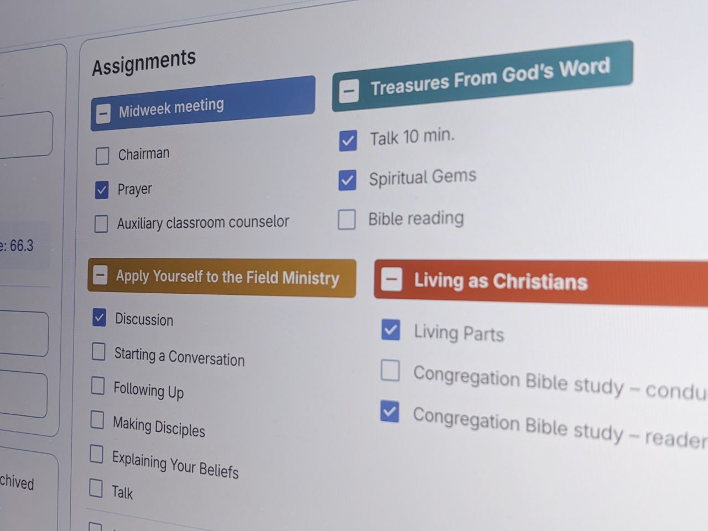

### Scheduling meetings: An important privilege

Scheduling our Jehovah's Witnesses midweek meetings is an important and demanding task that requires care and attention to detail! Explore how the Organized app can help you create well-planned midweek meeting schedules with ease and efficiency, resulting is better experience for your congregation. Read on to find out more!

<!-- truncate -->

Every brother who has done this type of appointemt, know how important to create schedules well in advance to give meeting participants enough time for preparation and how sometimes it is challenging to take into account to many small nuances, like another assignments or duites of the same person during the same day or personal requests regarding student assignments. 

To help "Our Christian Life and Ministry" meeting overseers and their assistants ease this process, the Organized app has been developed as a multi-platform scheduling app for Jehovah's Witnesses. It makes it simple for brothers to schedule meetings, as well as easy for publishers to view their assignments and always have the most up-to-date schedules. 

Let's see how Organized app can help you to make midweek meeting planning more efficient and free up some extra time for another important tasks in theocratic life and congregation.

### Sometimes challanges may arise

Meeting scheduling is a precious responsibility given by Jehovah and an opportunity to serve our congregations. However, we may encounter challenges due to imperfections in ourselves and the current world around us. One of the main challenges of creating our meeting schedules is the time it takes – often 2-3 hours or more each month. This involves carefully selecting the right person for each assignment, checking for assignment conflicts, copying and pasting part titles from our workbook from jw.org or JW Library, and calculating time allocations. In addition, filling out and printing PDF templates, as well as Meeting assignment forms (S-89), require additional effort. As a result, many congregations have a separate brother, known as the assistant of the midweek meeting overseer, who helps with these tasks. This assistance includes filling out information and distributing meeting assignment forms, adding a few more hours of work each month.

:::tip

What if we told you that you can reduce your monthly meeting scheduling process from 3-5 hours to just 10-15 minutes, including double-checks and manual adjustments?

**The Organized App makes this possible, all while offering improved quality and flexibility!**

:::

### Organized is right here to help you

This is where the Organized Jehovah's Witnesses app comes in to make scheduling better for everyone in your congregation! The app automatically fetches meeting program materials from jw.org (or alternatively .epub files), filling in all the meeting parts and songs for you, so you don't have to copy and paste each one manually. It also calculates the time allocation for each part, eliminating the need for manual calculations.

With flexible assignment setup, you can customize assignments for each person according to their skills and personal requests. The intelligent auto-assign feature ensures fair meeting assignments based on each person's past assignments and meeting part types, warning you about all potential conflicts. Once the schedule is created, you can publish it for other Organized users to see their upcoming meeting assignments in the app, export auto-generated PDF meeting schedules (S-140), and meeting assignment forms (S-89). Finally, you can put the schedule on the information board and distribute the assignment forms to students in either printed or digital form.

Here's how the Organized app assists during the whole scheduling process step-by-step: from fetching all the meeting information from jw.org, right through to generating the final print-ready schedule in PDF format.

### Real benefits, real difference

By using the Organized app, everyone involved in your congregation can enjoy numerous benefits!

For example, the midweek meeting overseer for planning can spend less time on routine copy-paste work and maintain a more balanced approach. His assistant can work more efficiently and reduce manual tasks. Appointed brothers and meeting students receive better thought-out assignments, get notified earlier, and even can view their assignments in the app, allowing them to prepare better and experience less stress.

### Sounds exciting? Are you eager to try it?

Experience how Organized enables you to plan midweek meetings for your Jehovah's Witnesses congregation more efficiently! [Try the Organized app in test mode](https://test.organized-app.com/) without even registering and explore its features using pre-filled dummy data. The app is designed to be a helpful solution that improves your workflow and saves time for other important things. 

Discover all the helpful features of Organized and see how it can improve theocratic life of your congregation!

