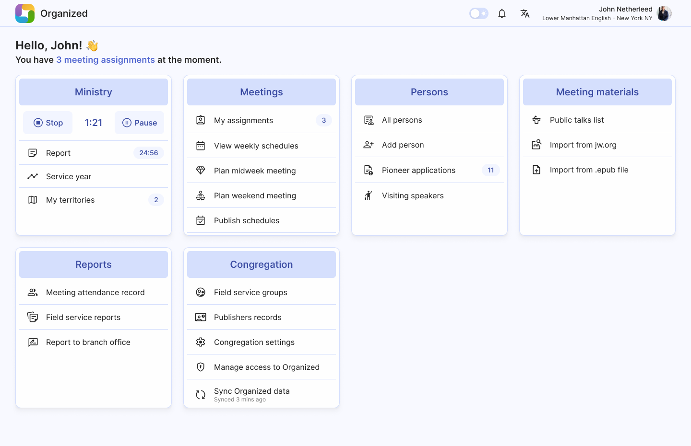
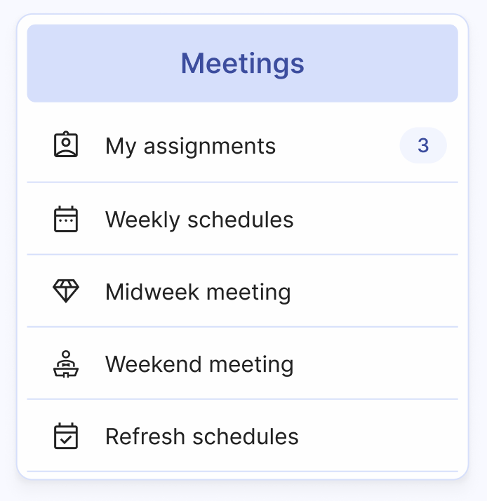
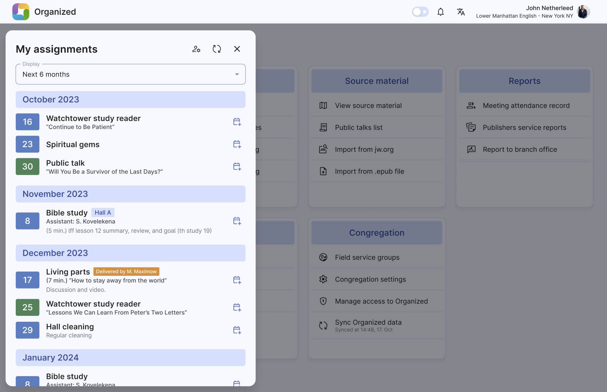
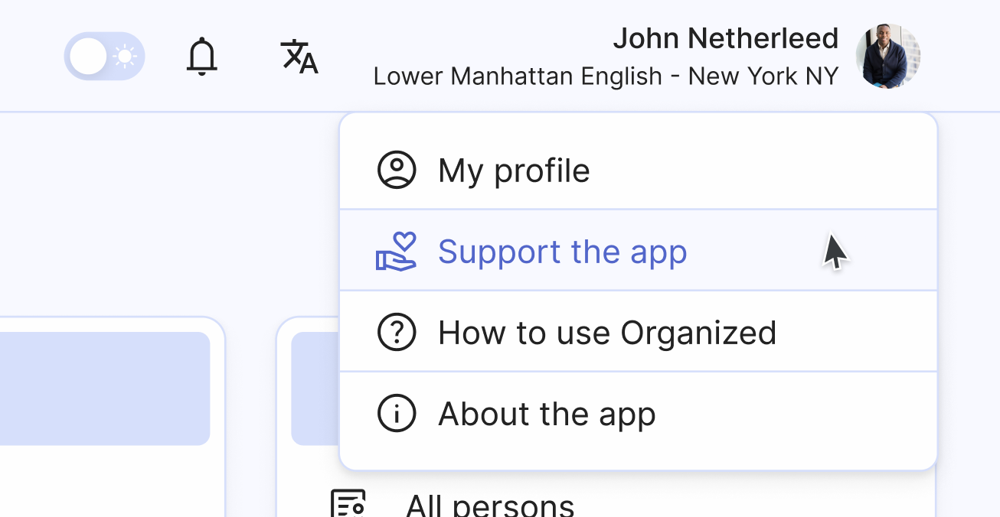
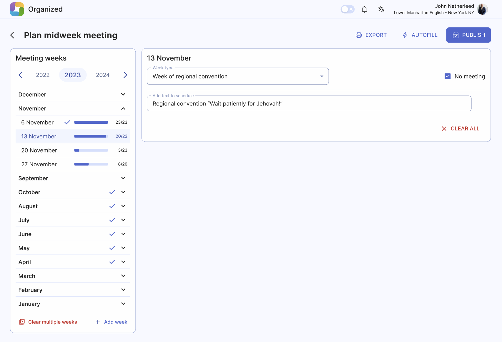

# App navigation

Once you've [registered](../onboarding/register-and-login.md) your account and joined your congregation, you'll land on the home page. From here, you can easily access all the features of the Organized app through the Home page dashboard. Let's take a closer look!

## Home page dashboard

When you first open Organized, you'll land on the home page. Think of this as your starting point to access everything the app offers. We've organized different congregation activities into easy-to-find categories like Meetings, Ministry, Persons, Reports, and more to be added with the new versions. This setup makes it simple for you to navigate and find what you need based on category.

## Exploring cards

On the home page, you'll see different cards representing each category, such as Ministry or Meetings. These cards act like shortcuts. Clicking on any card takes you deeper into that category, showing you more specific information or actions related to it. For example, clicking on the 'Meetings' card items will open a full page where you can view upcoming meetings or other related details.

## Upcoming assignments

By clicking ‘My assignments’ button, you find a complete list of meeting assignments you have coming up. These are tasks or responsibilities assigned to you for future weeks or months. You can add these assignments to your own calendar app to integrate it with your personal schedule.

## Header features

Look at the top of your screen, and you'll spot some useful tools in the header. Here, you can switch between light and dark modes for better viewing comfort, check your latest notifications, adjust the app language, or access your profile settings. Plus, we've added some extra helpful links like "How to Use Organized" and "Support the App" right there for easy access.

## Inside any page

Whenever you navigate inside any section or page, a few elements remain constant at the top:

1. the page name
2. the back arrow to return to the previous page
3. action buttons for main tasks
4. underneath, the actual content of the page you're viewing.

This consistent layout ensures you always know where you are and how to move around.

#### We've designed Organized with simplicity and user-friendliness in mind, making it easy for you to manage various congregation activities almost effortlessly! Now, feel free to explore other features and tips on other pages of the documentation!
