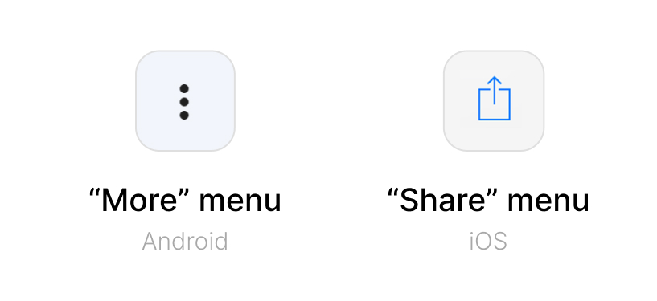
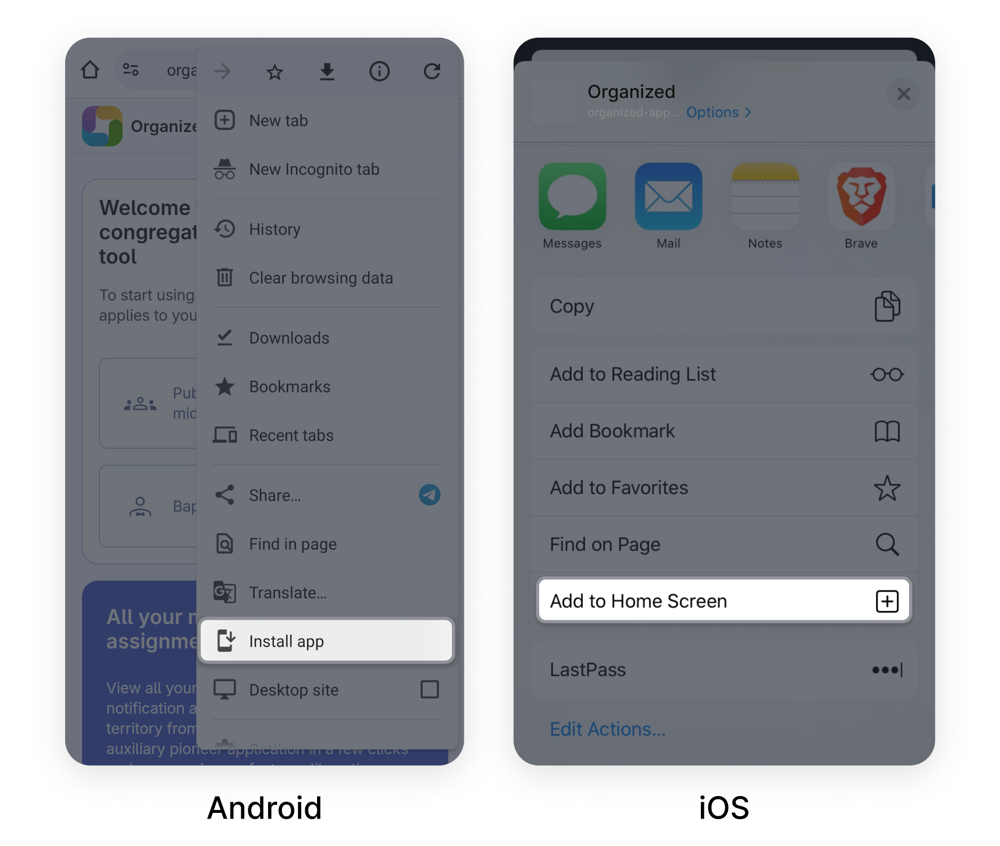

# Open and install the app

To open the Organized app, visit the organized-app.com link in your web browser; this is the central hub for accessing the app. You have the option to use the app directly in your browser or to install it for an enhanced experience. Once installed, the app can be used with or without an internet connection.

## How to install Organized on Android and iOS? 

Yes, you can use the Organized app with full functionality on your smartphone. You don't need to search for it in the App Store or Google Play. Simply follow these steps:
1. Visit the organized-app.com link in your web browser, and you'll instantly access the app. 
2. To install it, open the "More" menu _(usually represented by three dots on Android and a share icon on iOS)_.

3. Click "Install" or "Add to home screen" button from your browser's menu. 

4. Soon, the Organized app will be available in your app list.

With the Organized app installed on your smartphone, you can easily manage your personal study, field service, and congregation activities from anywhere, even when you're on the go.

## How to install the app on Windows?

The process is similar to the instruction above. To install the Organized app on Windows, follow these steps:

1. Visit the organized-app.com link in your web browser.
2. Click the "Install" button in the top-right corner of the page.
3. A pop-up window will appear asking if you want to install the app. Click "Install" again.
4. The app will be downloaded and installed on your computer.

Once the installation is complete, you can access the app from your Start menu or desktop shortcut.

**Note:** The Organized app is a Progressive Web App (PWA), which means it can be installed and used like a native app on your Windows computer. However, it doesn't require any special installation or download from the Microsoft Store.

## How to install Organized on macOS?

If you use any other browser besides Safari, the installation process is the same as the Windows installation steps above.

But if you use Safari, to install the Organized app on macOS and add it to the Dock, follow these steps:

1. Visit the organized-app.com link in Safari.
2. Click on the "File" menu in the top-left corner of the screen.
3. Select "Add to Dock..." from the dropdown menu.
4. A pop-up window will appear asking if you want to add the app to your home screen. Click "Add" to confirm.
5. The app will be downloaded and installed on your computer.
6. To add the app to the Dock, open Launchpad and find the Organized app. Then, drag the app icon to the Dock and drop it where you want it to appear.