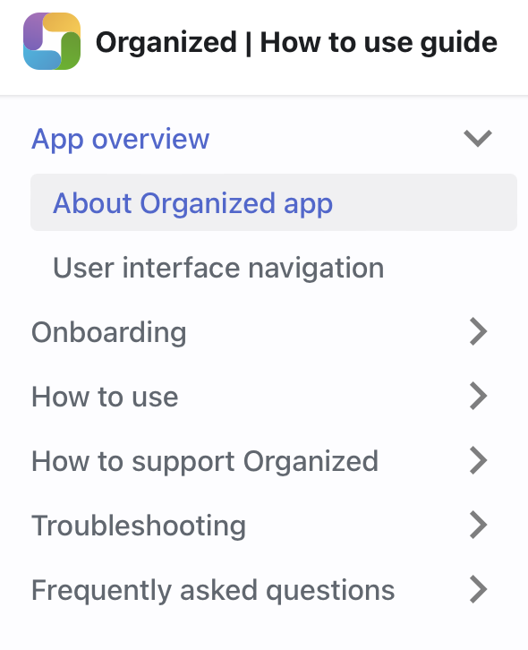

# Welcome to Organized!

[Organized](https://organized-app.com/) is a free progressive web application crafted specifically for Jehovah's Witnesses congregations. Developed by our team at Scheduling Workbox System, it's designed for ease of use by every member of the congregation. Watch our [introductory video to the Organized app](https://www.youtube.com/watch?v=2czQB-LEfqg) on YouTube or visit [About Organized](https://about.organized-app.com) website to get a quick overview. We are actively developing the app to bring more features and to make it more and more useful for every person in a congregation.

## What are the benefits of using the Organized app?

When it comes to benefits in real-life situations, consider the following: Reduced stress for every congregation member, hundreds of hours saved for appointed brothers, streamlined digital processes with way less waste, improved speed of collaboration, and enhanced convenience for all.

To explore the Organized concept, features, and its benefits in a more visual format, feel free to visit our [About Organized](https://about.organized-app.com) webpage — an ideal resource to introduce Organized to others, or view video tutorials on our [YouTube channel](https://www.youtube.com/@organized-app).

## How Organized is different compared to other theocratic apps?

We know that there are other apps aiming to support congregations. We're not trying to judge which app is the best. Simply try Organized to see if it's a good fit for you.

Some of the Organized differentiators are:

1.  **Free for everyone,**
2.  **Open-source code with full transparency,**
3.  **User-centered and design-first approach,**
4.  **Easy and convenient to use,**
5.  **Cross-platform flexibility,**
6.  **An active team dedicated to constantly improving the app.**

## Is Organized an official application from the organization?

No, it is not an official app from the organization of Jehovah’s Witnesses. Our team consists of volunteer brothers and sisters who serve in different countries. Organized offers beneficial features for congregations, but its use is your choice. We recommend speaking with your congregation elders before starting to use the app for the whole congregation.

## Why is Organized a web application? Is it safe to use in a congregation?

We believe that transitioning from desktop applications to web applications offers many advantages and greater flexibility, while still maintaining a high level of security. With web applications, you can access your data from any device with a browser, regardless of the platform or operating system. This means you can work seamlessly across Windows, Mac, Linux, ChromeOS, and mobile devices running Android, iPadOS, or iOS.

We understand the security challenges of web applications, and we've taken every step to ensure that your data is safe and secure. Our app is built using the latest and most advanced security technologies, and we're constantly working to enhance its security and keep up with the latest developments in web technologies.

To ensure that only members of your congregation can access your data, we've implemented a range of special security measures. These include local storage, end-to-end encryption, two-factor authentication, and an app lock feature. With these measures in place, you can be confident that your data is strongly confidential and always protected.

## Have more specific questions?

Do you have more questions about the Organized app, its security, features, relation to our organization, or usage in congregation? Check out our [Frequently asked questions](../faq) category for answers to these and many other questions.

## What's next?

Now that you have a better understanding of what Organized is and how it can benefit your congregation, we encourage you to continue exploring this comprehensive How to use guide. We recommend going through the articles from top to bottom to learn more about the app, or selecting specific categories and articles that you're currently most interested in or facing some troubles with.

Our guide covers everything from setting up your congregation to scheduling meetings, managing field service, and generating reports. With the guide, you'll find starting with Organized to be straightforward and efficient!
