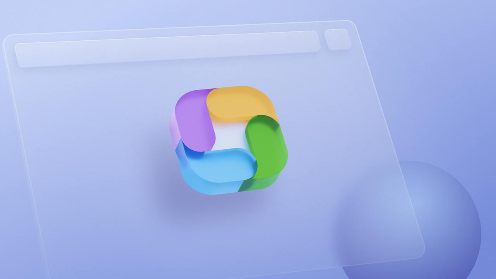

# Welcome to Organized!

[Organized](https://organized-app.com/) is a free application crafted specifically for Jehovah's Witnesses congregations. Developed by our team at Scheduling Workbox System, it's designed for ease of use by every member of the congregation. Watch our [introductory video to the Organized app](https://www.youtube.com/watch?v=2czQB-LEfqg) on YouTube or visit [About Organized](https://about.organized-app.com) website to get a quick overview. We are actively developing the app to bring more features and to make it more and more useful for every person in a congregation.

## See Organized in action — no registration required!

You’re just one click away from discovering everything Organized has to offer! Explore the app’s features using the [Test environment](https://test.organized-app.com/), where you can see how it works with pre-filled sample congregation information. It’s an easy way to check out the app without signing up. Feel free to experiment, but remember that any changes you make will be reset when you refresh the page. Previewing and testing the app hasn’t been this easy before!

## What are the benefits of using the Organized app?

When it comes to benefits in real-life situations, consider the following: Reduced stress for every congregation member, hundreds of hours saved for appointed brothers, streamlined digital processes with way less waste, improved speed of collaboration, and enhanced convenience for all.

To explore the Organized, its features, and benefits in a more visual format, feel free to visit our [About Organized](https://about.organized-app.com) webpage — an ideal resource to introduce Organized to others, or view video tutorials on our [YouTube channel](https://www.youtube.com/@organized-app).

## How is Organized different from other theocratic apps?

Organized is built with the user in mind, designed to serve you without a learning curve, huge time or stress investments, or extra maintenance. Our approach is simple: we love what we do, work with talented developers and designers to build the best user experience, and aim to share what we’ve created to make things easier and more... *organized* for other Jehovah’s Witnesses.

We know there are other apps for congregations, and we’re not here to say which one is best — that’s for you to decide. Just try Organized and see if it’s the right fit for you!

Some of the Organized differentiators to consider are:

1.  **Free for everyone, forever**
2.  **Open-source and fully transparent,**
3.  **User-centered design with a focus on simplicity,**
4.  **Quick, easy, and convenient to use,**
5.  **Works seamlessly across platforms,**
6.  **An active team committed to continuous improvements,**
7.  **Friendly, helpful support whenever you need it.**

## Is Organized an official application from the organization?

No, it is not an official app from the organization of Jehovah’s Witnesses. Our team consists of volunteer brothers and sisters serving in different countries. Organized offers beneficial features for congregations, but its use is entirely your choice. While the app is not forbidden, we encourage you to speak with your congregation elders before using it in your congregation. We also strive to follow the most up-to-date guidelines and comply with data protection laws, including GDPR, to ensure your information is secure.

## Is Organized a web/cloud-based, or native app? Understanding its functionality

Organized is not a cloud-based app, nor is it a native application. It's another type of application called Progressive Web App (PWA). While you can access it through a web browser, it is designed to work locally on your device. When you register and open the app for the first time, it automatically downloads and caches all necessary data on your device. After that, most interactions, such as managing tasks and schedules, are performed directly on your device, allowing you to use it even offline.

This approach provides significant benefits in terms of security and convenience. Since your data is stored locally, you maintain full control over it. Additionally, because Organized isn't internet-dependent, you can continue to use it without needing a constant connection – ideal for managing congregation tasks wherever you are.

## Why is Organized a PWA application? Is it safe to use in a congregation?

We believe that moving from desktop to web applications offers many advantages and greater flexibility for congregations, while maintaining top-level security. With a web application, you can access your data from any device with a browser—whether you're using Windows, Mac, Linux, ChromeOS, or mobile devices like Android, iPadOS, iOS, or even less popular systems like SailfishOS and HarmonyOS. This makes working across platforms seamless and more convenient.

We understand the security challenges that come with web applications, and we've taken all necessary steps to keep your data safe. Our app is built using cutting-edge security technologies, and we're continuously improving it to stay ahead of any challenges and comply with main data protection regulations like GDPR in Europe. To ensure that only your congregation members can access sensitive data, we've implemented several security features, including local storage, end-to-end encryption, two-factor authentication, and an app lock feature. With these measures in place, you can be confident that your congregation's data remains confidential and protected at all times. To learn more about our Organized's security and GDPR compliance, see the [FAQ – Security](../faq/security.md) page.

## Have more specific questions?

Do you have more questions about the Organized app, its security, features, relation to our organization, or usage in congregation? Check out our [Frequently asked questions](../faq) category for answers to these and many other questions.

## What's next?

Now that you have a better understanding of what Organized is and how it can benefit your congregation, we encourage you to continue exploring this comprehensive How to use guide. We recommend going through the articles from top to bottom to learn more about the app, or selecting specific categories and articles that you're currently most interested in or facing some troubles with.

Our user guide covers everything from setting up your congregation to scheduling meetings, managing field service, and generating reports. With the guide, you'll find starting with Organized to be straightforward and easy!
