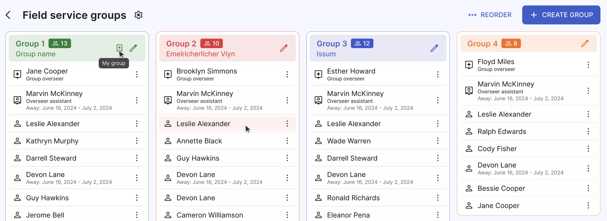
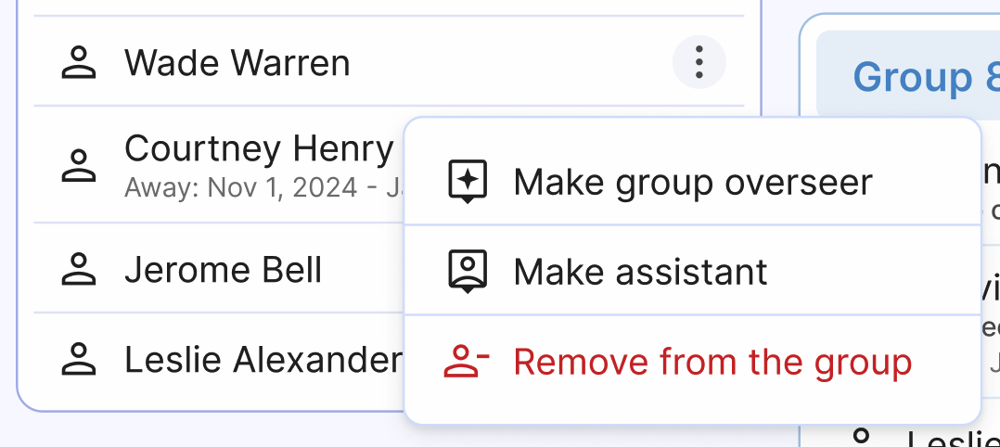
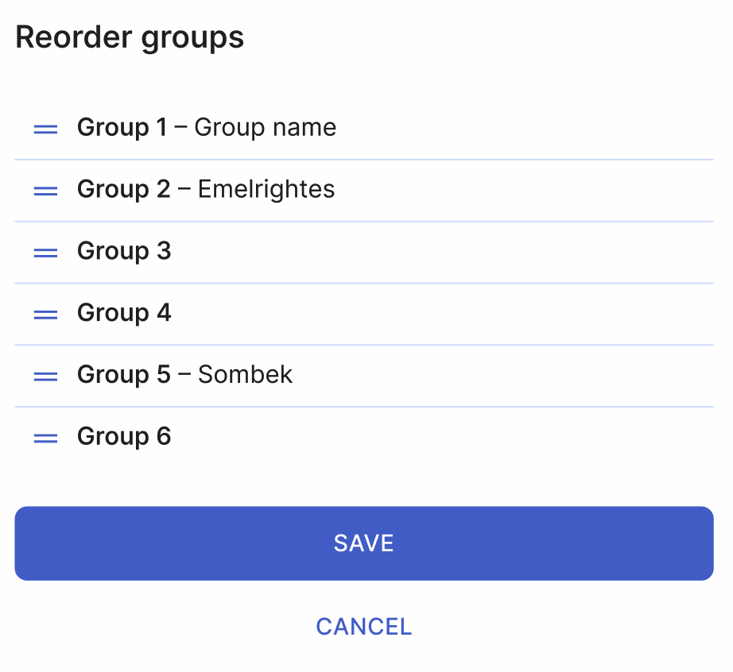

# Field service groups

## Overview

The Field service groups page is one of the key pages in the Organized app. Creating and updating field service groups is important for keeping person records, reports, and congregation statistics accurate. We recommend setting up all field service groups before [adding individual person records](../persons/add-person.md). This approach makes it easier to assign each newly added person to a specific group directly while editing their details, without needing to switch back and forth between pages.

## Create a group

Creating a group is pretty straightforward. Start by clicking the 'Create group' button. 

You'll be guided through two steps to enter all the required group details:

1. **First step: Group details**. Enter the group name *(optional)*, select the group overseer, and choose the overseer's assistant.
2. **Second step: Add publishers**. Select publishers from the list to add them to the group. If you prefer to add publishers later, simply skip this step and click 'Create'.

Once done, the group is created. Continue adding groups and their details until all your congregation's groups are set up.

:::tip[Keep in mind]
Group numbers are assigned based on the group's **order in the list**. You don’t need to manually assign group number. If you wish to change the group's number, reorder the group list accordingly.
:::

## List of groups

After adding all groups, you will see multiple cards on this page, each representing a group. At the top of each card, you’ll find the group number and name (if added), as well as the count of publishers in the group. Your own group is marked with a 'My group' icon.

In the group members list, the group overseer is listed first, followed by the assistant. Below them, you’ll see the list of all publishers in the group. If any person is marked as away, their away dates will be displayed under their name.

By clicking the 'More' menu (three dots in front of the name), you can access these quick actions:

- Make group overseer
- Make assistant
- Remove from the group

## Reorder groups

Click the 'Reorder'' button to view the full list of groups. To reorder, click and drag any group to move it up or down, and drop it in the desired position. The group number will update automatically.

## Edit group

To edit a group, click the 'Edit' pencil icon at the top of any field service group card. In edit mode, you can:

- Change the group name (optional; some congregations use names based on locality).
- Reorder publishers within the group.
- Add new publishers.
- Remove existing publishers from the group using the red 'Remove publisher' button next to any person.
- Delete the entire group by clicking the 'Delete' button in the top right corner and confirming your action.

Once you've made your changes, click either 'Save' to apply them, or 'Cancel' to discard them.

## All set!

Great work! Your field service groups are now created and set up. With these groups in place, your congregation’s statistics will be more accurate, and you and other users will have a clear overview of all your congregation groups. Adjusting details in your groups is now just a few clicks away.