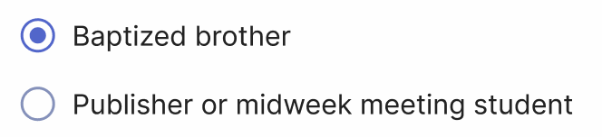
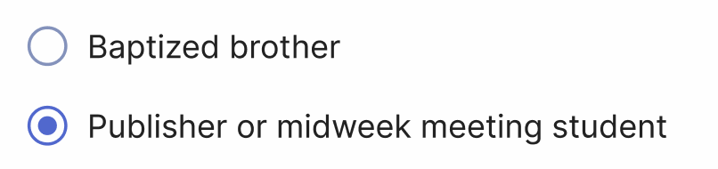

# Invite persons to your congregation

To invite persons to your congregation on Organized, follow these steps based on their user type. There are two global user types: "Baptized brother" and "Publisher or midweek student".

- **"Baptized brother"** is any baptized brother. We create an account for any baptized brother specifically, so that his profile is already in the right user group once he is appointed to a ministerial servant or other assistant role.

- **"Publisher or midweek student"** is any other member of the congregation, including baptized sisters, unbaptized brothers or sisters, or male or female students on a midweek meeting.

Click "Add new user" button on the "Manage access to Organized" page. Then, follow the steps below based on the user type you want to invite.

## Baptized brother

To add a baptized brother to your congregation, he should already have an account registered in Organized. Once he has registered, you can search for his account by email address and add his to your congregation.

1. Select the corresponding **"Baptized brother"** option.

2. Ask a baptized brother for the email address he used to register in Organized.
3. Use this email to add him to your congregation.

:::info[If you see "No user found with this email address":]
Ensure you enter the correct email address without typos and that the brother has indeed created an Organized account and sees the "Thanks for registering" message in the Organized app.
:::

4. Once you enter a correct email address that already exists on Organized, the email field will be highlighted with green saying _"User found! Create user and set up his profile and rights"_.
5. Click "Create user" button and then his user record will be added.

## Publisher or midweek student

To bind a user profile with a person record from your congregation, ensure that you have already added this brother or sister to the congregation's [Persons page](../how-to-use/persons/all-persons).

1. Select the corresponding **"Publisher or midweek student"** option.

2. Select a person record from the list. Make sure that the person record already exists on the [Persons page](../how-to-use/persons/all-persons.md) so that you can find it. 

:::warning[This step is very important!]
You **must select a person record** that matches this new user to proceed. Why is this important? Binding the new Organized user to an existing person record *(which contains name, qualitications, assignments, contant info, etc)* ensures that when they join your congregation in Organized, they can immediately view their upcoming assignments, submit their field service reports, and have their data correctly linked in congregation reports.
:::

3. After you selected the person from the list, simply click "Create user" button.
4. Right after that, you will see the "Invite user" window with their personal unique invitation code. Provide this personal invitation code to grant them access to your congregation on Organized.

:::tip[The invitation code will always be accessible]
Note, that this code will also be available on their user page, so no need to worry that it will disappear after you close this window. You can always access or regenerate it later.
:::

5. Copy the code and give this code to the user in a secure way. You can manually copy it, or use "Copy" or "Share" button to share it faster.
6. After clicking "Done", the new user record will be added.
7. Provide your Congregation access code to the new user so they can connect to your congregation without any issues. However, it's crucial to emphasize the importance of keeping this code confidential. Encourage users not to share it with others, even within the congregation. If someone else needs the Congregation access code, they should be directed to ask the elders or the Organized app administrator. While Organized takes many steps to keep your data secure, maintaining the confidentiality of this information is a shared responsibility.

## Well done!

That's the basics of inviting brothers and sisters to your congregation on Organized app. To learn more about managing the users, their roles and rights, please see the [Manage access to Organized](./manage-access) guide.
