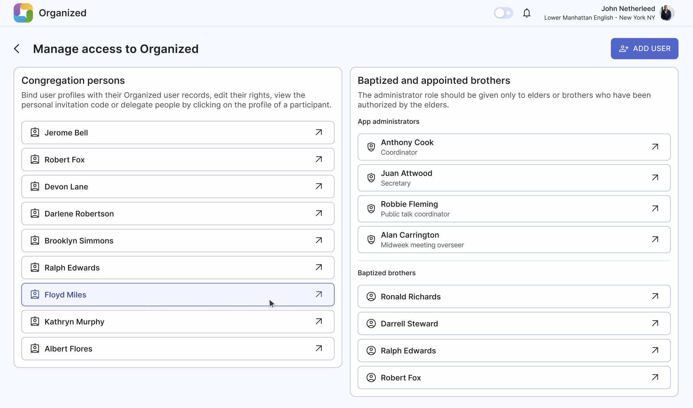
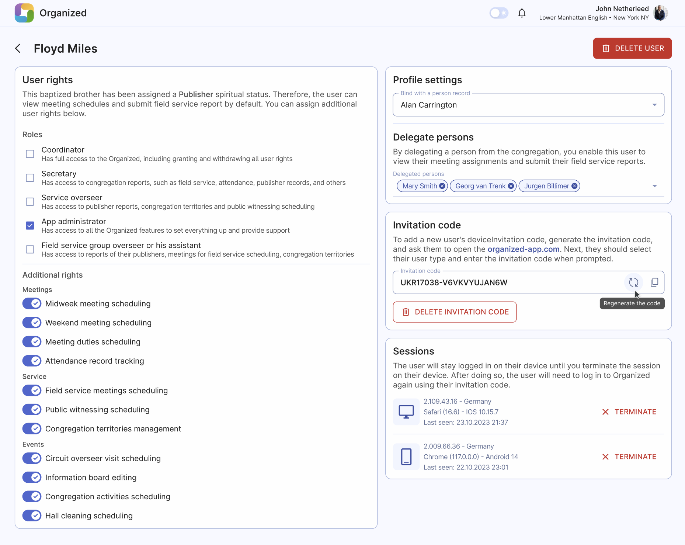
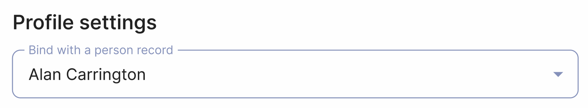
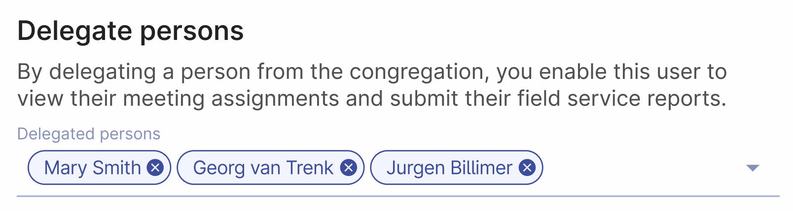
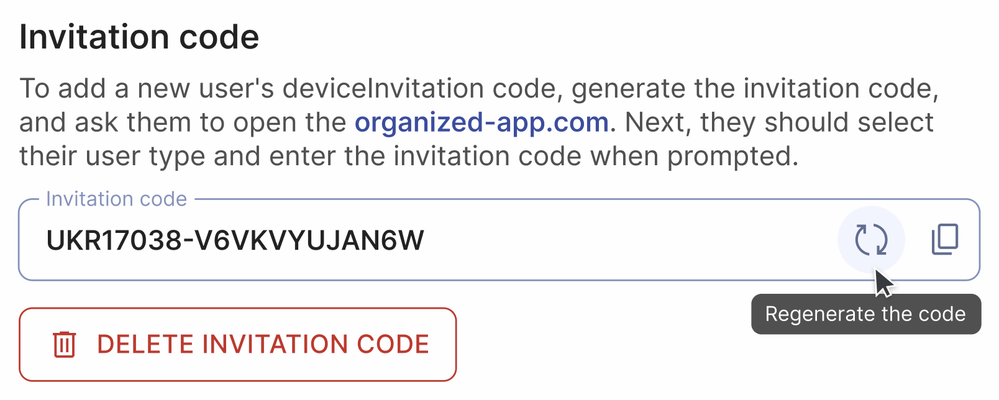
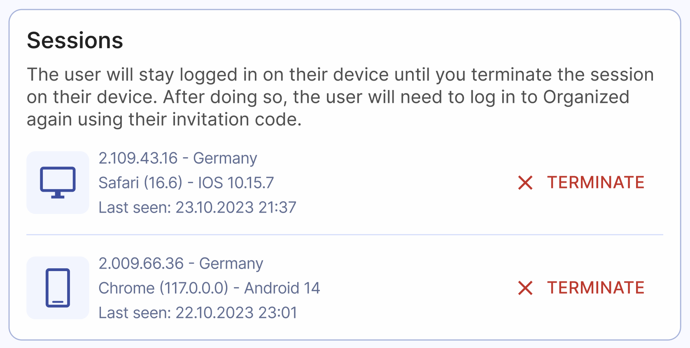

# Manage access

Organized provides flexible user access management for your congregation. Access the 'Manage Access' page from the 'Congregation' card on the home page to view and manage all users and their roles.

## View all users

This page displays all users connected to your congregation who have registered in the Organized app and can view your congregation's information and schedules.

:::info
User profiles are **not the same as person records**. User profiles represent real Organized app users in your congregation, while person records are a list of all congregation members used for reports and scheduling.
:::

## Add user

Click the 'Add user' button and then select whether you want to add either a **Baptized brother** or a **Publisher or midweek meeting student**. Then, follow the instructions of the app to finish adding new user. For detailed step-by-step guide, read the [Invite persons to your congregation](invite-persons) guide.

### User types

There are three types of users:

1. **App Administrators**: Users with specific roles and rights, such as reporting, meeting scheduling, or app administration. Ensure that only authorized elders have the administrator role. Consider appointing a reliable brother as an 'App Administrator' to maintain the app and support other users. However, be aware that this role has a similar level of access to the Coordinator role, so choose wisely.
2. **Baptized Brothers**: All baptized brothers in the congregation. This separate user category simplifies adjusting user roles and rights when a brother takes on new responsibilities.
3. **Congregation persons**: Includes baptized sisters, unbaptized brothers and sistes, and midweek meeting students.

## Edit user profile

Open a user profile to access detailed access management. User profiles of baptized brothers have additional rights and roles available, while user profiles of unbaptized publishers, baptized sisters and midweek meeting students don't have those. Let's see what settings are there!

### User rights

Each user type has a default set of rights, but you can select additional roles and rights as needed:

#### Roles

Assign one or more congregation roles to a user. In larger congregations, each appointed brother typically has one role, but in smaller ones, brothers may have multiple roles assigned.

#### Additional rights

Select as many additional user rights as necessary, grouped by category: Meetings, Service, Events, etc.

### Profile settings

Bind a user profile with a person record to allow the user to view upcoming assignments and submit reports.

### Delegate persons

Delegate one or more persons from the congregation to a user, enabling them to view meeting assignments and submit field service reports on their behalf. This feature is useful for assisting elderly or incapacitated publishers who cannot use the Organized app.

:::warning
Avoid delegating too many persons to a single user. This feature is intended for specific cases only, and overloading a user with too many delegations may negatively affect their experience.
:::

### Invitation code

Generate, regenerate, or delete a personal invitation code to connect to your congregation. Deleting the code will prevent the user from connecting to the congregation on a new device.

### Sessions

Review and terminate (end) device sessions. This feature is useful in cases of lost devices, suspicious activity, or an urgent need to revoke a user's access to your congregation.

### Delete user

Use the big red 'Delete user' button at the top of the page to delete a user profile. Upon opening the app next time by the user, the user's local data will be erased, and they will be directed to the registration page. Deleting user cannot be undone, but you can always re-add them later if needed.

:::warning
Please note that deleting the **user account** will not remove their **record from the Persons page**.
:::