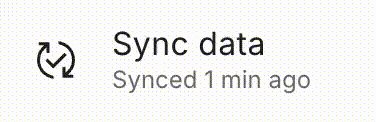

# Sync data

This simple "Sync data" button allows you to quickly synchronize your Organized data with data of the congregation, for example for others to see your newly created schedules, recently added persons or changes in public talks. Usually, the data **automatically syncs** every 5 minutes. But if you need to sync the data immediately, you can use this button.

## Simple click is all you need

Right at the button you can see when the data has been last synced. If you want to synchronize it right now, simply click on it and wait a few seconds until sync is complete.

