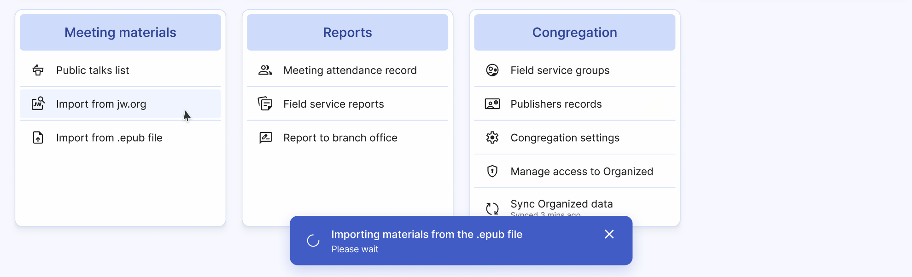
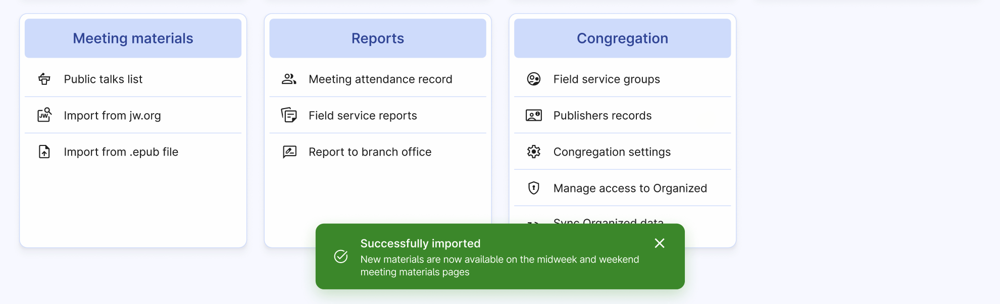

# Import from .epub file

Importing meeting materials from jw.org is simple and fast with Organized! On the "Meeting material" card, click the **Import from .epub file** button.

The import will be completed in a few seconds.

The imported meeting materials language matches your [Congregation settings](../congregation/congregation-settings.md) import language setting. So, if you're getting wrong language materials imported, please check out the settings on that page.

:::danger[If you get an "Selected .epub could not be imported" error]
To avoid this error, please make sure that the language settings for importing meeting materials match the language of the .epub file and try again.
:::
