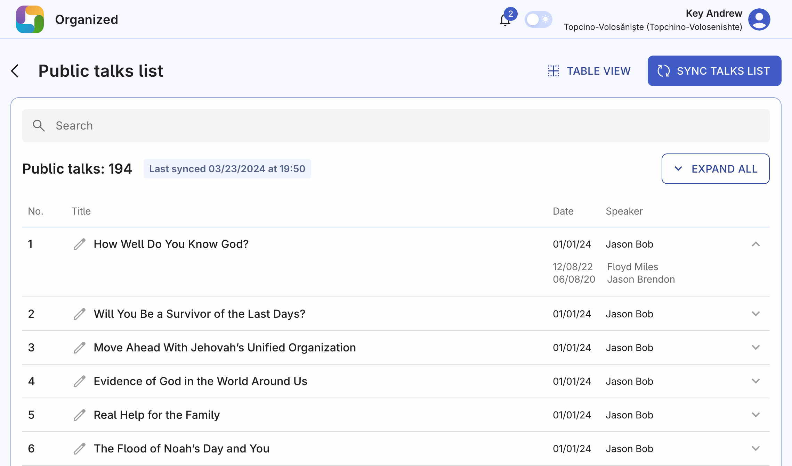
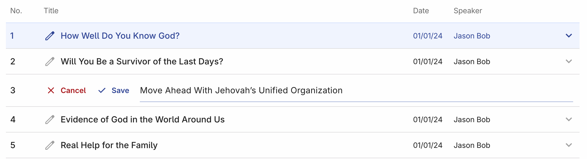
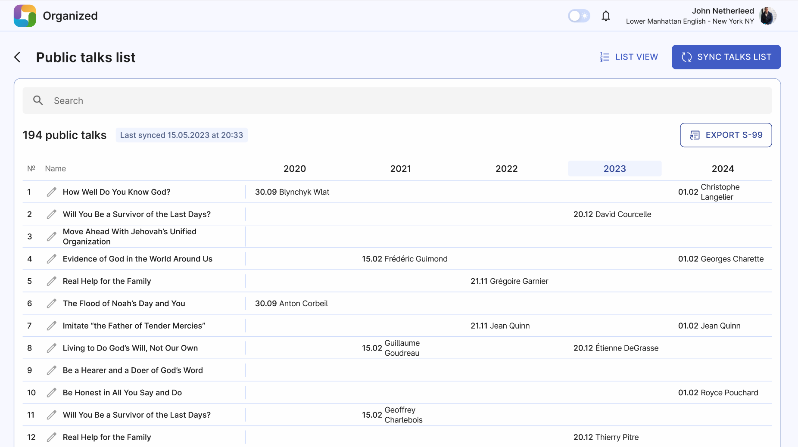

# Public talks list

On this page you have a full list of public talks for your congregation. View the talks, past speakers and their talk dates. 

The main elements on this page are:

- **Sync talks list:** Get a list of public talks number and titles. Click the button to check for the latest changes.
- **Search bar:** Type talk title or speaker name to view corresponding search results.
- **Last synced time:** Time and date of last talks list synchronization.

## List view

List view provides you a full list of all public talks. You can sort them by number, title, last delivery date, and speaker name. Click on any of those columns title to apply sorting.
Click on any of the talk rows to expand it and see more past speakers. 

Click "Edit" icon to edit the talk's title and Save it.

## Table view

Table view of the public talks provide more S99-like viewing experience with the multiple years displayed as a columns. 5 past years are available to see. On smaller screens you might need to swipe left-right to navigate between different years.

