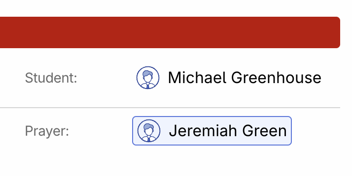
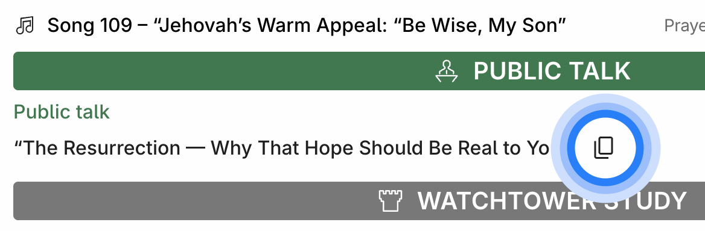

# Meeting schedules

Meeting schedules is one of the core pages in the Organized application. This is a view-only page, which combines schedules published by different appointed brothers on corresponding scheduling pages so everybody in the congregation can find all the schedules in one place!

On this page, everyone in your congregation can view all the latest meeting schedules that are currently published. This page is accessible to all Organized users, including publishers and midweek meeting students, to stay up-to-date with the meeting program and their assignments. Each schedule has a 'Last updated' badge to help the meeting overseer ensure that the latest version is published. This way, users can view the most recent schedule without worry and communicate better among congregation members by ensuring everyone references the same version of the schedule.

## Select schedule type

You can find tabs for Midweek Meeting, Weekend Meeting, and Outgoing Publishers _(if your congregation elders have enabled them. If not, some tabs may not be available)_. To navigate, simply click on the corresponding tab at the top of the page.

## View any date

By default, Organized shows current week's schedules. If you want to see future meetings or even browse through past few weeks, you can easily do so. To return to today's date, just click the 'To current week' button. Feel free to explore without getting lost!

## Quickly find your assignment

Finding your assignments is quick and easy! Just look for the colored background in the participant list. Your name will be highlighted whenever you have an assignment for a specific meeting part.

## Copy a public talk title in one click

Want to share a public talk title, for example with an interested person? Click the 'copy' icon next to the title, and it’ll be copied to your clipboard. Then, just paste it into your preferred messaging app.

## Additional badges

You will see handy reminders like the circuit overseer's weeks, marked on the schedules. This helps everyone stay informed and plan their participation in advance.

## How to edit the schedules?

If you need to edit any existing schedules or create a new one, go to the [Midweek meeting](./midweek-meeting) or [Weekend meeting](./weekend-meeting) pages. The Meeting Schedules page is for viewing schedules, while those two pages are designed for creating and editing schedules. If you're a midweek or weekend meeting overseer, make sure to use these pages to their full potential. Check out our user guide for detailed instructions on how to efficiently use them.