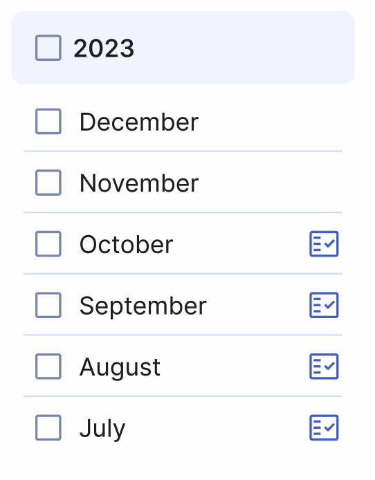
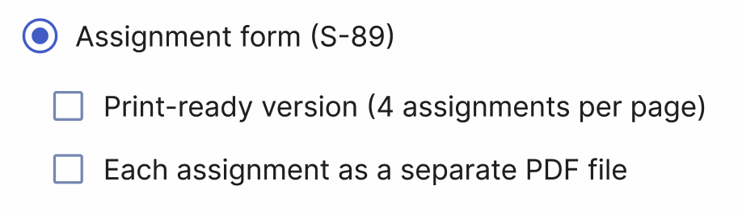

# Midweek meeting scheduling

Once you have the corresponding user role and rights to edit midweek meeting schedules, you'll see the Midweek meeting button on your home dashboard page. Click it to access the page where you can effortlessly schedule your congregation's midweek meetings.

_Although this user guide article may seem long, the midweek meeting scheduling feature is very intuitive. Our goal is to describe the process in detail, helping you discover new approaches, features, and troubleshoot any issues easily._

Let's explore all the scheduling possibilities of the Organized app to ensure you're using its full potential! This will make your work easier and improve the quality of assignments for brothers and sisters.

## Page structure

The navigation and layout are simple yet contain many powerful features. Let's break down the page structure:

- At the top of the page, you'll see key action buttons related to midweek meetings: **Publish**, **Autofill**, and **Export**. We'll dive deeper into each of these later.
- On the left-hand side, there's a list of **meeting weeks**. You can browse between different months and even years from here.
- On the right-hand side is the main **scheduling card**, where you can fill out the entire meeting schedule with assignees.

Now that the structure is clear, let's move on to the scheduling steps!

## Step 1: Prepare

### Check Person Assignment Qualifications

Before starting your first scheduling session, ensure that all congregation members have the correct set of [assignment qualifications on their Person page](../persons/add-person#assignments). This page allows you to flexibly specify available assignments for each meeting part for every individual in the congregation. Double-check that everyone in your persons list has the right assignments set up. This way only the qualified persons will be suggested and selected for specific meeting parts with specific roles (e.g. Student or Assistant, Bible study conductor or Reader, etc.).

### Import Meeting Materials from the Workbook

On the home page dashboard, click the '[Import from jw.org](../meeting-materials/import-jw-org)' button *(or alternatively use the [import from .epub file](../meeting-materials/import-epub) button to upload an .epub file from your device)* to automatically import the entire meeting program from the meeting workbook. This includes weekly Bible reading text, songs, meeting part titles, durations, source materials, and everything else you need to start scheduling. Thanks to this automatic import, you won't need to manually calculate durations or perform repetitive copy-paste actions to get all the program part titles right.

:::tip[Import from jw.org]
Although the import from jw.org is performed automatically every few weeks to ensure you always have the newest meeting materials ready for scheduling, **this automatic import doesn't happen instantly after each small update on jw.org**. If you want to be 100% sure you have the latest version of the schedule, click the 'Import from jw.org' action button on the home page dashboard each time before creating a new schedule. This takes only a few extra seconds but removes any uncertainty.
:::

## Step 2: Start Scheduling

Now that you have all the meeting materials from the workbook imported and ready for scheduling, let's proceed with choosing a specific week, selecting its type, and then assigning all the parts either manually or automatically. We'll also share some additional 'professional' tips at the end of this step.

### Select Week

Choose a week from the 'Meeting weeks' list. It contains all 12 months for each year, and by expanding any of them, you can access a list of weeks for each month. From here, it's easy to track scheduling progress by viewing the progress bar and the number of assignments scheduled compared to the total assignments count for that particular week.

### Select Week Type

During most of the year, the week type is simply 'Normal week'. However, for special weeks and events, there are corresponding presets to help organize schedules more effectively:

- Visit of circuit overseer
- Week of Circuit Assembly
- Week of Regional Convention
- Week of Memorial
- No meeting

**Tip:** When a week has no meeting, instead of leaving all fields empty and moving on to the next one, use one of these presets. Selecting one will add extra indicators to the schedules both in the app and on the print, notifying publishers in your congregation. You can even optionally leave a message to be displayed on the schedules for dates when there's no meeting, specifying context (such as assembly/convention name, date, and place) which will be beneficial for brothers and sisters.

### Assign Automatically with Autofill Feature

In Organized, the Autofill button allows you to fill out all desired schedules in just a couple of seconds! An intelligent algorithm behind this feature takes into account each publisher's last assignment, its date, hall given in, and previous partner – everything for improved and balanced scheduling.

Trying out Autofill is uncomplicated:
1. Click on the button
2. Select a desired date range (start week and end week)
3. Confirm by clicking 'Autofill'

Right after, you'll see a progress bar representing all assignments being autofilled with qualified persons. In a few seconds, the autofill process is complete!

From this point, you can easily check all meetings week-by-week and make manual changes if needed. Usually, Autofill does a great job, but feel free to review and double-check everything to ensure you're confident in the scheduling result.

:::info[Did you know?]
There are two approaches to using Autofill in Organized:
1. Fill out specific meeting parts (e.g. that require a specific elder to conduct or have a special theme needing careful assignment) in advance, and then use Autofill to complete **only the rest** of the assignments.
2. Autofill **all weeks first**, then go through each meeting and make manual changes for parts requiring extra attention.
:::

*You're free to use Autofill and manual assigning in any combination that's convenient for you. Don't worry if you use Autofill and then make manual updates – all your changes to assignments are taken into account for the next time you use the Autofill feature. Everything is automated and intuitive!*

### Assign manually

Now, let's review a case where you'd like to assign all meeting participants manually by choosing each one for each program part. Although it's a longer process, it's also a good approach that adds a personal touch, which you might prefer. Organized supports this approach as well, with providing you with additional useful information for even better scheduling!

#### The process is straightforward – go through each meeting part and select an assignee.

Yes, it's as easy as it sounds. Click on the assignee selection field to view the list of eligible persons, and select the best fit for this meeting part. Persons are sorted in a recommended order – those at the top of the list haven't had this type of assignment for a longer period, while those at the bottom had it relatively recently.

:::warning[Conflicting Assignments]
If a brother already has another assignment or duty for the same date, or will be away, you'll get a warning message under each corresponding assignee field. You can either re-assign another person or ignore the warning if it's your conscious decision. Organized will let you publish this schedule without any problem.
:::

Additionally, there's another helpful feature for your manual scheduling to keep you better informed:

### View publisher's assignment history

When unsure about a specific assignment for a student or brother, you can view their past assignment history for context by clicking the Assignment history button on the right side of their name once they're selected. This comprehensive information includes the types of past assignments, exact dates, partners they worked with, and even which hall it was given in. This helps you make more balanced decisions that benefit students, and it's easy to view all the history at a glance.

### Pro scheduling tips:

#### Two edit modes

The editing mode switch at the top of the scheduling card keeps the page layout clean, as you'll mostly need to edit assignments. However, Organized provides additional functionality for editing meeting parts when necessary. Let's see what each mode does:

* **Edit assignments:** This is the standard mode. It displays meeting parts as view-only on the left side of the screen, while allowing you to assign brothers and students to these parts on the right side. This mode is ideal for your regular scheduling, when there are no changes to the meeting program itself.
* **Edit parts:** This is an optional mode for modifying the meeting program structure. Use this mode when you need to: 1. Adjust existing program parts *(e.g., change titles or durations)*, 2. Replace parts with custom content *(for instance, when a Governing Body Update takes the place of a regular part)*, 3. Add new, custom meeting parts to the program *(when approved by the body of elders)*. /This mode is particularly useful for weeks with special schedules or when you receive updates from the branch office.

*Using 'Edit parts' mode enables you to overwrite existing meeting parts and create a custom one, adding flexibility to schedules imported from jw.org*

:::warning[**Important:** ]
You can only work in one mode at a time – either 'Edit assignments' or 'Edit parts'. This separation keeps the scheduling process simple and organized. To switch between modes:
1. If you're in 'Edit parts' mode and need to assign people, click the mode switch to return to 'Edit assignments' mode.
2. If you're assigning people and need to modify the meeting structure, switch to 'Edit parts' mode.

All your changes are saved automatically and immediately.
:::

#### Delete multiple assignments

Need to clear several assignments at once? The 'Delete multiple assignments' feature is here to help. Instead of removing assignments one-by-one, use this button, which is located under the month list in the 'Meeting weeks' card.

After clicking, you'll see a window asking for the date range you'd like to clear. This can be one week or even multiple months. Once you've selected the date range, click the 'Clear selected weeks' button. All assignments within that range will be cleared and ready for re-scheduling. **Note that meeting parts (titles, duration, etc.) won't be deleted; this feature clears assignments only.**

#### Collapse/expand meeting parts

Simplify your view with the collapsible meeting sections:

1. Look for the three main meeting part titles:
   - TREASURES FROM GOD'S WORD
   - APPLY YOURSELF TO THE FIELD MINISTRY
   - LIVING AS CHRISTIANS

2. Each title has a colored bar. Click on any of these bars to hide or show the content beneath it.

3. Use this feature to:
   - Manage screen space, especially on smaller devices
   - Focus on specific sections you're currently scheduling
   - Minimize distractions from already assigned parts

This collapsible design helps you concentrate on the task at hand and makes scheduling more efficient, particularly when working with partial assignments.

## Step 3: Publish the schedules

Great! Once you've scheduled all the meetings you wanted to, it's time to publish the schedules. Only after this step will everyone who is using Organized be able to view the schedules and see their upcoming assignments in the app.

:::danger
Without publishing the schedule, no one using the Organized app will see the new schedule you've just created. **Don't forget to publish schedules** every time you finish working on them and want to make them available to others in your congregation.
:::

Click the 'Publish' button and select the specific month you want to publish. Previously published months will have a corresponding indicator icon, making it easy to see which months are left to publish based on your recent scheduling. Avoid publishing schedules that aren't fully filled out yet. Within a few minutes after publishing, everyone in the congregation will see that the new schedule is available.

## Step 4: Export for print

Now, let's save the meeting schedule and student assignment forms to print them out, put them on the information board, and hand over assignment forms to students personally. This ensures everyone in your congregation has easy access to the newly created schedule, not only in Organized but also in your Kingdom Hall 🙂 The Export feature works quickly and reliably, even without an internet connection.

### Export meeting schedule (S-140)

Click the 'Export' button at the top of the page. Select the desired month range for exporting, then choose the **Midweek meeting schedule (S-140)** option. Hit 'Export,' and in a few seconds, your schedule in print-ready PDF format will be downloaded to your device. It's that easy and quick!

### Export meeting assignment form (S-89)

Click the 'Export' button at the top of the page and select the desired month range. This time, select the **Assignment form (S-89)** option. You'll have the standard export option and two optional choices. Select none or any suitable checkboxes:

- **Standard export (when no additional check boxes selected):**  Each page of the PDF will be the size of the original assignment form, with one assignment per page. You'll get one file containing all assignments as separate pages.
- **Print-ready version (4 assignments per page):** Each page of the PDF will be A4 paper size and contain 4 assignments, making it easy to print, cut, and distribute multiple assignment forms at once.
- **Each assignment as a separate PDF file:** You'll download multiple PDF files (as many as there are assignments), each with one assignment form in its original size. This is ideal for sending assignments digitally via Telegram, WhatsApp, email, or other communication tools, or for further custom placing and printing according to your needs.

## Well done!

By following this guide, you've created, published, and exported your midweek meeting schedule. Now you're familiar with features that help you create more flexible schedules faster and more accurately than ever before! Next time you create your midweek meeting schedule, it will be quicker. If you need any help, refer back to this guide to refresh your memory on the process steps and useful tips.

If you think this article could help another brother you know, don't hesitate to share it. When more people are aware of Organized's capabilities, it becomes even more time-saving and helpful for the whole congregation.