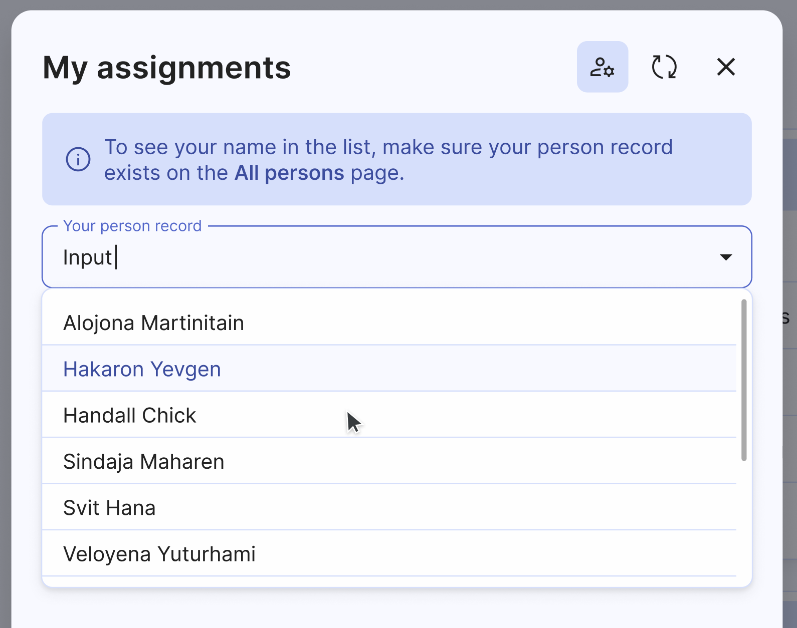

# My assignments

My assignments – is one of the most-used features of the Organized app. It's used by everyone in a congregation of Jehovah's Witnesses, who takes part in our weekly meetings. Here you can view all your upcoming assignments, whether it's a student assignment, public talk, Kingdom Hall cleaning, or meeting duties.

## Open 'My assignments' panel

There are multiple ways to open this panel, ensuring you can quickly and easily access this important information in Organized:

1. **'Meetings' card**. There's a dedicated 'My assignments' button which also has an assignments count badge for you to know the exact number.

2. **Home page 'Hello' message**. Right under greeting message you can find the number of active upcoming meeting assignments. Click on the blue text to open the assignments panel with all the details.

3. **Mobile bottom navigation bar**. On your mobile device, you can access your upcoming assignments panel by clicking on the 'Assignments' button at the bottom navigation bar.

## Set a time range to display

If you have many upcoming assignments, you can use the 'Display' setting to select how many months you want to display on this sidebar. You can choose to display assignments for the next 3 months, 6 months, or 12 months.

## View your upcoming assignments

All assignments are displayed in chronological month-by-month order. Each assignment row contains the following information:

- **Date**: Displayed prominently in a rectangular box, all assignments are sorted by date. Date box has two different colors: 🔵 **Blue** for the midweek meetings, and 🟢  **Green** for the weekend meetings.
- **Assignment type**: The specific part of the meeting that you have been assigned to conduct.
- **Hall**: Either "Hall A" or "Hall B", indicating the main hall or an auxiliary classroom.
- **Assistant name**: The name of the assistant for student assignments or the second speaker for a symposium.
- **Additional details**: Any other relevant information, such as source material or talk title.
- **'Delivered by'**: This orange badge indicates assignments of congregation persons that have been delegated to you (meaning you can view their assignments and notify delegated persons about the upcoming assignments). It displays the name of the person who has the assignment, along with all the necessary details.
- **Add to calendar button**: On the far right side, you can click this button to add any assignment event to your personal calendar.

## Add assignments to your calendar

Hover over an assignment row to see the 'Add to calendar' button. Clicking this button will open your calendar app, allowing you to add the event. Supported calendar apps include Google, Apple, Microsoft (365, Outlook, Teams), and Yahoo. Then, you can add this event to your personal calendar, set up notifications, reminders, etc.

## Refresh the assignments list

By clicking the 'Refresh' button it the top right corner, you can ensure you're viewing the most up-to-date list.

## For administrators: Select a person record

As an app administrator, you are responsible for binding user profiles with person records for all members of your congregation. However, since no one could do this for you, you need to manually select your own person record from the list to view your upcoming assignments. Select a correct person record from the list and click 'Save'

This feature also allows you to support other members of your congregation by giving you the ability to view the assignments of other publishers or midweek students if they are experiencing any issues.

