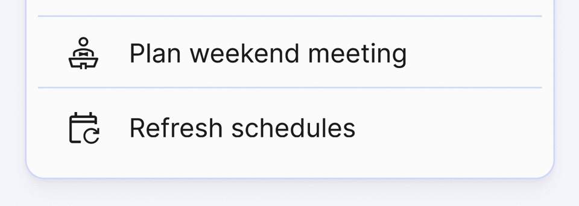

# Refresh schedules

Although Organized automatically syncs all data every 5 minutes, you may want to ensure you have the latest schedule versions immediately. To manually check for the latest schedule updates at any time, use the "Refresh schedules" button. This quick action will download the most recent schedule versions available in Organized.

## Click the button

You can find the "Refresh schedules" button at the bottom of the "Meetings" card on the home page. Just click it to update all published schedules with any recent changes. This button is available for publishers, midweek students, and responsible brothers to use.

