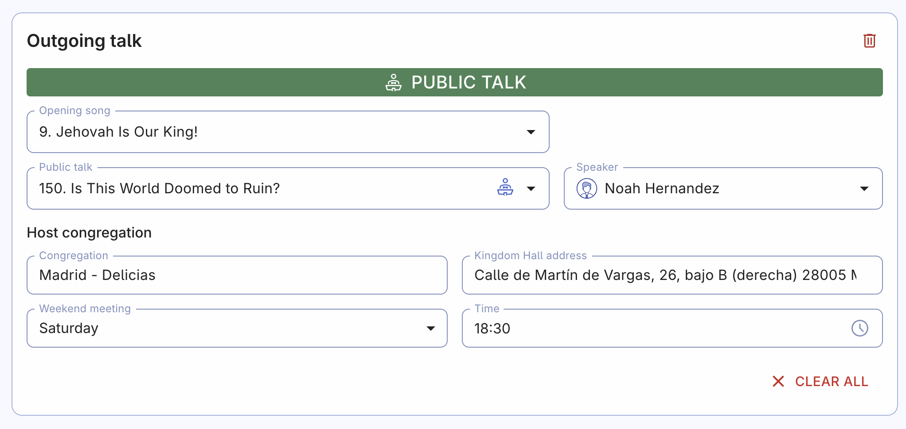

# Weekend meeting scheduling

Creating weekend meeting schedules in the Organized app is as simple as a few clicks! Whether you're scheduling only public talks, or whole weekend meetings, this guide will help you do it efficiently and accurately. Let's see what features Organized provides! 

## Page structure

The weekend meeting scheduling page is designed with simplicity in mind, while also offering powerful features to make scheduling easier. Here’s how the page is structured:

- **Meeting weeks** selector. This section lets you quickly navigate between months and weeks, allowing you to easily view the scheduling progress for each particular week. Also, there’s a **Delete multiple assignments** button that lets you clear several assignments at once. 
- **Scheduling** area. On another content card, you'll see the  area with all the fields that are ready for scheduling.
- **Quick settings**. You’ll find these at the top of the page for easy access. These settings are shortcuts to options from the [Congregation settings](../congregation/congregation-settings) page but only affect the weekend meeting scheduling. Remember, changes here will impact the whole congregation, so use these shortcuts to adjust settings related specifically to weekend meetings.

*Quick settings button*

## Meeting scheduling

### Prepare: Import meeting mterials from the meeting workbook

On the home page dashboard, click the '[Import from jw.org](../meeting-materials/import-jw-org)' button *(or alternatively use the [import from .epub file](../meeting-materials/import-epub) button to upload an .epub file from your device)* to automatically import the entire meeting program from the meeting workbook. This includes weekly Bible reading text, songs, meeting part titles, durations, source materials, and everything else you need to start scheduling. Thanks to this automatic import, you won't need to manually calculate durations or perform repetitive copy-paste actions to get all the program part titles right.

:::tip[Import from jw.org]
Although the import from jw.org is performed automatically every few weeks to ensure you always have the newest meeting materials ready for scheduling, **this automatic import doesn't happen instantly after each small update on jw.org**. If you want to be 100% sure you have the latest version of the schedule, click the 'Import from jw.org' action button on the home page dashboard each time before creating a new schedule. This takes only a few extra seconds but removes any uncertainty.
:::

### Autofill feature

We highly recommend using the Autofill feature to achieve the most balanced scheduling and save your time. The intelligent algorithm considers previous assignments and each person's qualifications, as well as availability, making the scheduling process faster and more efficient. Autofill is easy to use and highly reliable—give it a try and see for yourself!

### Manual scheduling

If you prefer to schedule manually, Organized still provides valuable tools such as assignment history, suggestions, and conflicting assignment warnings. Here’s how to do it:

1. **Select a week type:** Choose the appropriate week type from the list, such as a normal week or a special event.
2. **Start scheduling:** Begin by scheduling the opening song, chairman, and prayer (if needed). The following instructions will explain some more details and useful tips.

### Public talk

When scheduling the public talk, you have three options to start with:

- **Local speaker:** Select a speaker from your own congregation.
- **Visiting speaker:** Choose a speaker from another congregation. This can be done using the shared catalog of speakers or by manually entering the details.
- **JW Stream recording:** Select this option if you plan to use a recorded talk video.

Use the [Speakers catalog](../persons/visiting-speakers) button inside the public talk field to access a list of all available speakers and talks. This feature makes it easy to select and schedule speakers with just one click. If you take care of this in advance, you can also get a list of songs that the speaker has chosen for the public talk. 

:::warning
Always arrange visiting speakers directly with their public talk coordinator before adding them to the schedule. Even if you have access to the shared visiting speakers list, direct prior communication is required to  confirm dates, titles, and speakers.
:::

### Watchtower study

After scheduling the public talk, fill out the remaining meeting parts:

- **Watchtower study:** The main conductor is automatically pre-filled unless unavailable. If you need to assign another conductor, select one from the dropdown menu. Only brothers with the Watchtower study conductor qualification will appear in the list. [Edit person](./persons#edit) to update qualifications if needed.
- **Reader and concluding prayer:** Assign the Watchtower study reader and, if the speaker is unavailable, assign another brother to give the concluding prayer.

### Outgoing talk

You can also include outgoing talks in the schedule — these are talks given by your congregation's speakers at other congregations. To do this, click the 'Add outgoing talk' button under the main meeting scheduling card and enter the details, such as the title, songs, speaker's name, and host congregation. Scheduling these talks in the Organized app helps keep everything in one place, making sure speakers are well-prepared. It also helps with communication between congregations since outgoing talks are synced if they're both using Organized, ensuring speakers know about their assignments ahead of time.

### Clearing assignments

- **Delete outgoing talk:**C lick the delete bin icon in the top right corner of the outgoing talk card. Confirm the deletion, and the talk will be removed from the schedule.
- **Clear all assignments:** Use the **Clear all** button to remove all assignments for the entire week at once, saving time compared to manual deletion.

## Publishing and exporting

Once you’ve finished scheduling, it’s crucial to **publish** the schedules so everyone in your congregation can see their assignments. If you don't publish, the new schedules will remain invisible to others in the app. Remember, creating schedules is just the first step—you also need to publish them as soon as you're done.

Click the 'Publish' button and choose the month you want to make available. Published months will have an indicator icon, so you can easily see which months still need to be published based on your recent work. Make sure not to publish incomplete schedules. After publishing, the new schedule will be visible to everyone in the congregation within a few minutes.

After publishing, you can also **export** the schedules as PDF files for printing or sharing. Click the 'Export' button, select the date range you want to export, and confirm the export. The PDF file will be downloaded to your device within seconds. The export feature even works offline, no internet connection is required! 👍

## Great work: Your scheduling is complete!

By following these steps, you’ve ensured that your weekend meetings are well-organized, with all participants informed and prepared. As you become more familiar with the Organized app, you'll find that scheduling becomes faster and more intuitive, making your planning process not just efficient, but almost effortless!