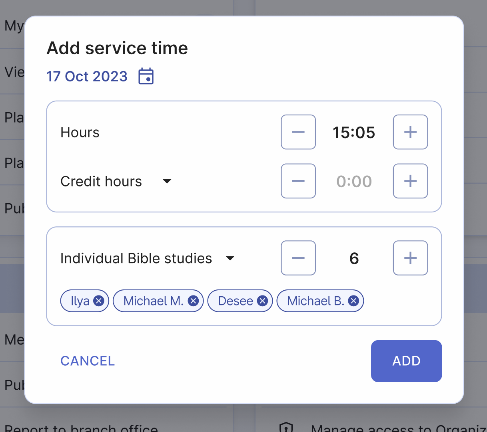

# Ministry timer

The ministry timer is a helpful tool for Jehovah's Witnesses who serve as pioneers to track their daily ministry. It's conveniently located at the top of the home page to be easy to access and to use. Let's explore how to use it for accurate monthly service reporting.

## Start... Pause... Stop.

To accurately track your ministry time, start the timer when you begin your ministry. If you need to take a break, simply pause the timer and resume it when you're ready to continue.

When you finish your ministry, open Organized and click the "Stop" timer button. A confirmation pop-up window will appear immediately after, which we will discuss in the next paragarphs.

## Forgot to start the timer? No problem!

If you forget to start the timer, you can still adjust the time. Just click on the displayed time (e.g. 00:00) and enter the amount of time you've already spent in ministry. Click "Done" and the entered time will be added to the ministry timer, which will continue counting further. Then, simply don't forget to stop the timer when you finish your ministry.

## Add time and studies manually

If you forgot to use the timer or need to add time manually, use the "+ Time" button on the left side of the ministry time widget. 

It will open a window where you can enter the following information:

- **Correct date**: The today's date is selected by default, but you can adjust it if needed. It's important to enter the correct date to accurately track your daily ministry history.
- **Ministry hours**: Add full hours by clicking + or - buttons. You can also add more precise time by clicking on the time and writing it usign your device's keyboard.
- **Credit hours**: If enabled in the profile settings, you can add time spent for authorized theocratic projects. You can also choose one of the presents from the dropdown (e.g. Pioneer school or School for Kingdom vangelizers), which you can adjust afterward.
- **Bible studies**: Add studies either by clicking + button or by selecting your studies from the drobdown list. Learn more about this in the next paragraph.

## Add and delete Bible studies

Adding your individual monthly Bible studies is simple with the + or - buttons. However, if you have multiple studies, consider creating a list of your studies for better organization.

If you have regular Bible studies, it's recommended to add them to your list of Bible studies and then select them from the list when adding time. This way, the names of the individuals you study with will appear in your service report for the month, making it easy to keep track of all your studies and not miss any of them.

### Add new Bible study

To create a list of your Bible studies, follow these steps:

1. Open the "Individual Bible studies" dropdown menu.
2. Click on the "Add new Bible study" button.
3. Create a name for your Bible study, following your local theocratic guidances – write either a name of a person or anything else that will help you to identify this study.
4. Click "Save" button to save this study to your list.

### Edit or delete existing Bible study

If you want to edit a study's name or delete a study that you don't conduct anymore, follow these steps:

1. Open the "Individual Bible studies" dropdown menu.
2. Find the study you want to edit or delete and click on the "Edit" icon.
3. An additional window appears, where you can change a name of the study or delete it.

## Select Bible studies from your list for your report

Now, once you've added all your regular Bible studies into the list, it's easy to add them to your report after the study has been conducted. To do this:

1. Open the "Individual Bible studies" dropdown menu.
2. Click on the Bible study name(s). They are added to your report's total studies count atomatically.
3. To remove such study from the report, either click on the cross icon on the corresponding study badge, or open the individual Bible studies list and uncheck any study by clicking on it once again.

#### Well done! Now you know how to add your ministry information, including time and Bible studies, both manually and using the convenient ministry timer feature. The app will help you to stay organized and accurate in your reports.