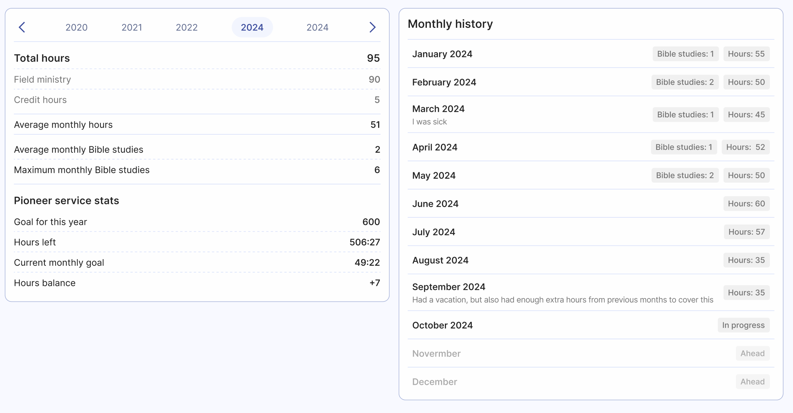

# Service year

The Service year page in Organized is your personal space to view your ministry statistic throughout the service year. Here, you can easily track your progress, month by month, and stay motivated to reach your personal goals.

## Navigate between service years

At the top, you'll see a year selector – choose a service year you would like to view. By default it's the current service year, but these tabs allow you to switch between different service years, so you can look back at your past ministry if you need to.

## See your total hours and averages

On this page, you’ll find the months list and see the reports with either 'shared' or 'not shared in the ministry' indicators. Alongside, you can also view the numbers of Bible studies conducted by you:

- **Avarage monthly Bible studies**: Average number of individual Bible studies conducted each month throughout the service year.
- **Maximum monthly Bible studies**: Maximum number of individual Bible studies conducted during one month.

## Extra details for pioneers

If you’re serving as a pioneer, there are more info and stats just for you! Organized shows all the details to have the whole serive year overview and be able to adjust your plans to achieve the annual goal. Here are the statistics you can see on this page as a pioneer:

- **Avarage monthly hours**: Average number of field service hours (including any credit hours).
- **Goal for this year**: The total annual goal in hours, depending on your pioneer ministry type.
- **Hours left**: How many hours you have left to reach the annual goal in total.
- **Current monthly goal**: Based on extra or missing hours from past months, this number shows how much time you need to do each month to meet your goal by the end of the service year. It updates automatically with each new report.
- **Hours balance**: The total of either extra hours or missing hours carried over from previous months. It only counts submitted reports, helping you see if you're ahead or need to catch up to meet your goal.

## View your monthly history

To the right, you can see a month-by-month breakdown of your field service ministry. Each record shows the number of Bible studies you conducted and, if you're pioneer, the total hours spent in ministry for that month. Comments from the monthly reports are displayed there as well. The current month is marked as 'In progress', and upcoming months are noted as 'Ahead'.

## Summary

This page helps you monitor your progress, adjust your goals if needed, and stay on track throughout the year. Make sure to timely enter all your ministry activity to keep everything accurate. Don’t forget to use the comments field to inform your group overseer and congregation secretary about any special situations that might have impacted your field service.