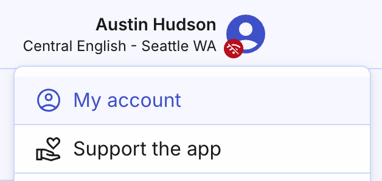

# My account – your account settings

That’s the page where you can customize settings of your Organized user account. Take a moment to explore and make adjustments as necessary to enhance your experience with Organized.

To open 'My account' page, click on the top-right account button in the header.

## Basic parameters

### Name 

The name you provide here will be visible in the app and to your congregation administrators. However, it won't change how your name appears in the schedules. To change it, please ask your elders, as the name on the schedules and forms is based on the [Person](../persons/add-person.md) record.

### Email address 

The email you used to register in Organized can't be changed by user. Please contact us at [support@organized-app.com](mailto:support@organized-app.com) to request the email change.

### Log out
 
After logging out, your Organized account will be removed from the device (but the account itself will not deleted). However, you can log in again whenever you need to.

