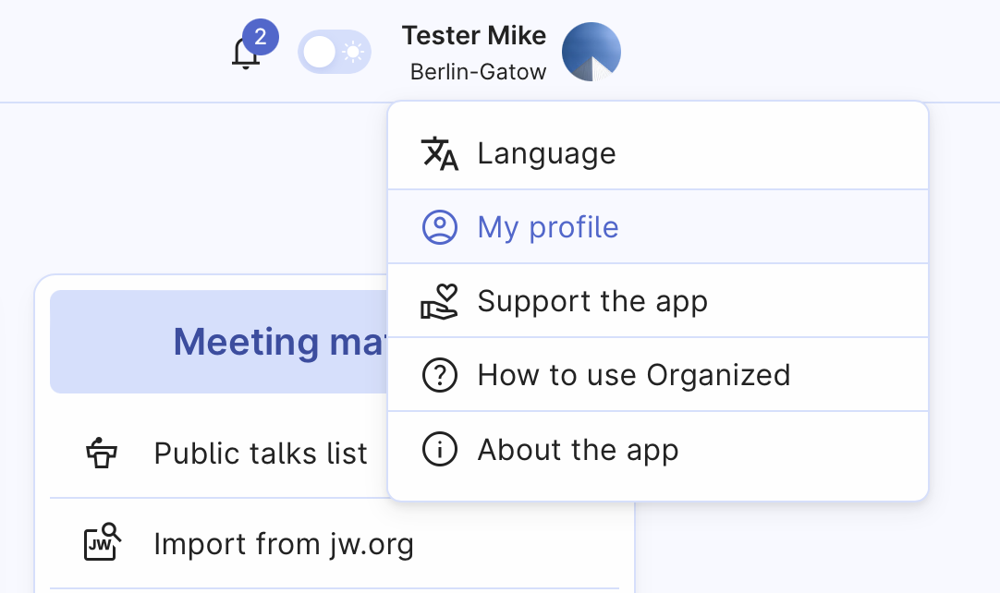
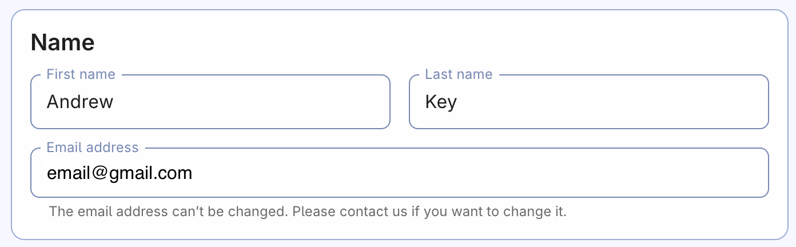
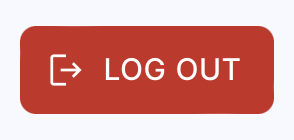

# My profile – your account settings

That’s the page where you can customize settings of your Organized user profile. Take a moment to explore and make adjustments as necessary to enhance your experience with Organized.

To open My profile page, click on the top-right profile button in the header.

## Basic parameters

### Name 

The name you provide here will be visible in the app and to your congregation administrators. However, it won't change how your name appears in the schedules. To change it, please ask your elders. 

### Email address 

The email you used to register in Organized can't be changed by user. Please contact us at [support@organized-app.com](mailto:support@organized-app.com) to request the email change.

### Log out
 
After logging out, your Organized account will be removed from the device. However, you can log in again whenever you need to.

